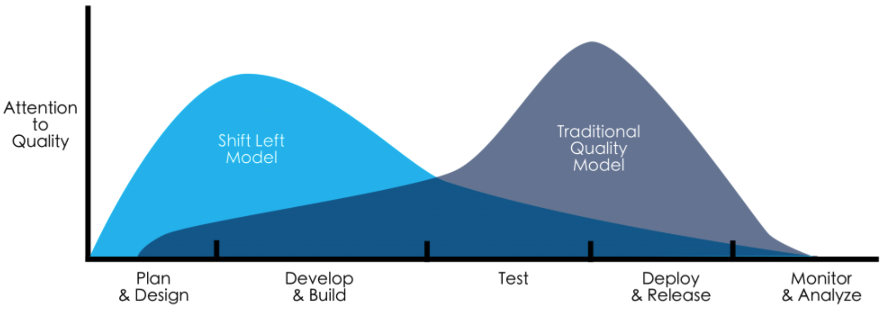
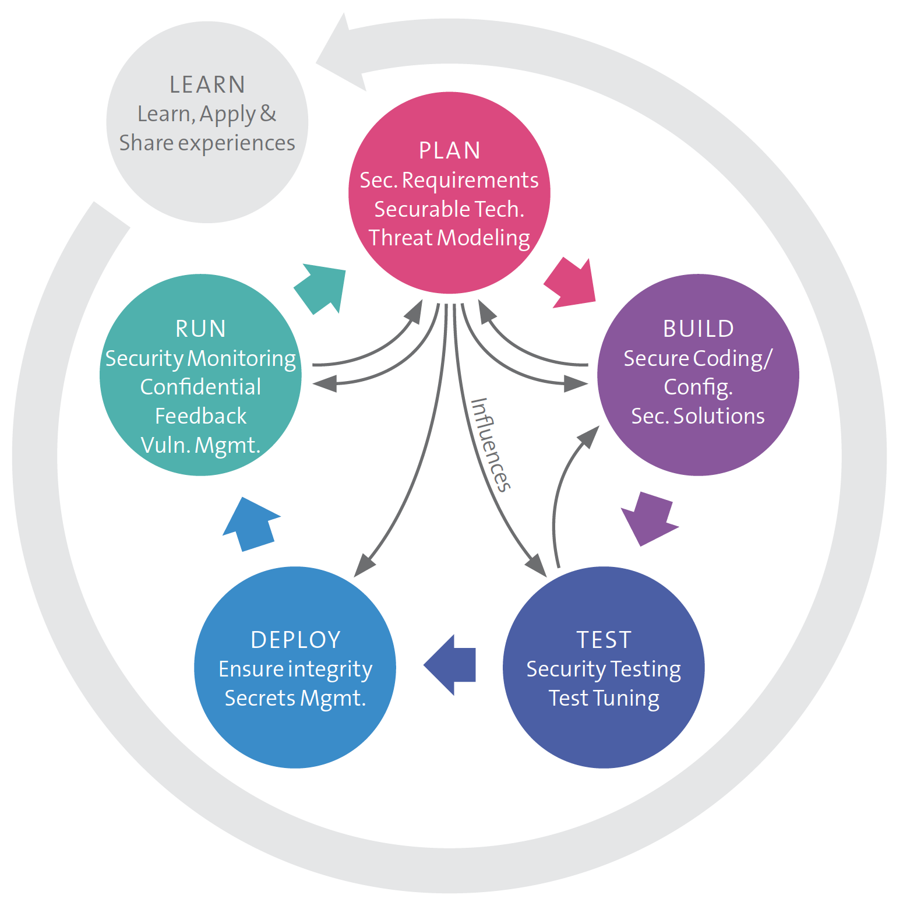
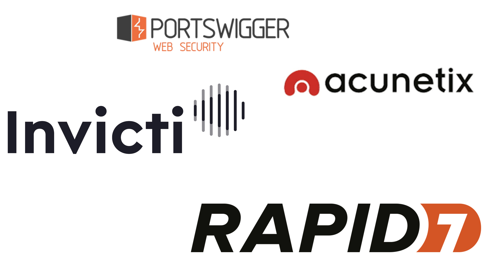
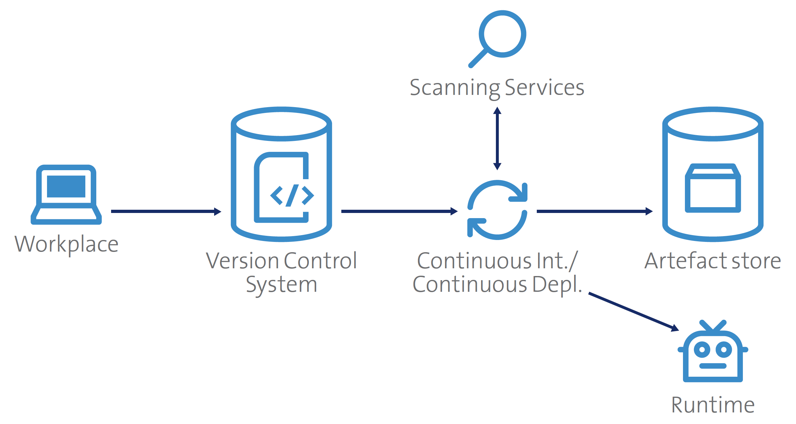

# {{ title }}

This chapter briefly describes the individual building blocks of the DevSecOps principle, each with some examples of tools/standards/methods, etc.

{ width="90%" }

### Food for thought
> Today, we live our lives online. The internet has no geography. It has no borders. By creating the internet, mankind opened up a Pandora’s Box where tangible borders and recognizable enemies ceased to exist.
>
> Mikko Hypponen, Chief Research Officer, F-Secure

## Shift left
What does shift left means?

Security practices and testing are performed **earlier** in the development lifecycle, hence the term shift left can be used.

{ width="90%" }

## DevSecOps building blocks
The different stages in the traditional SDLC must be extended with the security building blocks that are depicted in the following sub chapters.

### Training and Awareness (T&A)
Because security is distributed throughout the **entire development process**, a good understanding of security is required throughout the **entire development team**. T&A is a topic that must be addressed by everyone (engineers, architects, business representatives, ...) across the team and the organization.

Continous training, awareness actions, communication channels and much more are just some of the actions that have to be done in this all over building block.

### Organizational scaling
Scaling in a company is very difficult, thus **all** parties in DevOps must increase the security. 

!!! information "Old non-DevOps structures have a ration like this"
    100 developers → 10 operators → 1 security specialist

**Shift-left** transfers the responsibility for security directly to the DevOps teams, thus DevSecOps.

!!! danger "Skills set needed"
    The right skills must be present in the DevOps team!
    
    The benefit of this is that overall **security awareness** in the team increases due to the diversity in the skills

Security roles in a large-scale company are: *Security Officer*, *Security Coach* and *Security Champion/Ambassador*. And all they build up the **Security community** for the DevSecOps approach!

### Security in planning activities (Requirements  -  Architecture & Design)
Everything as code is a central principle of DevOps and of course also of DevSecOps. Therefore the creation of code must be **well prepared** and **carefully considered**.

Security activities must take place (in the SSDLC) already in phases like **requirements gathering**, **architecture** and **design**.

!!! information "Security requirements"
    (Security) requirements will come, beside from the functional requirements, from sources like:
    
    - Legal provisions (e.g. GDPR)
    - Compliance (e.g. ISO27001, Finma circular)
    - Handling of data and information according to internal data classification and specifications
    - Customer requirements

Existing sources of security requirements are easy to find out in the Internet (a not complete list):

- [OWASP - ASVS](https://owasp.org/www-project-application-security-verification-standard/)
- [Standard of good practice, ISF](https://www.securityforum.org/services/standard-of-good-practice/)
- [Center of Internet Security (CIS)](https://www.cisecurity.org/)
    - [Control excel](img/CIS_Controls_Version_8.xlsx)
- [Minimum Information Security Requirements for Systems, Applications, and Data - University of Michigan](https://safecomputing.umich.edu/information-security-requirements)

#### Threat modeling
All results obtained in the threat model influence the security activities in subsequent phases of the SSDLC

{ width="70%" }

### Technical security activities (Implementation - Verification)
Technical security activities are those steps that are either directly technically feasible or which directly influence the implementation of a product.

Ready-to-use solution help the DevSecOps team to onboard quickly security solutions/tools in the development process and the entire CI/CD pipeline. The DevSecOps team should have a **catalogue** of existing solutions, which finally mitigate threats discovered during the threat modeling. 

!!! information "Security solutions (examples based on STRIDE)"
    - **Authentication**: (multi-factor) authentication as a service that can be integrated into an application
    - **Integrity**: Public Key Infrastructure (PKI) as automated service to enable signing and encryption of artefact and user data
    - **Traceability**: logging solutions that allow for security monitoring
    - **Confidentiality**: Libraries and services for encrypting and accessing sensitive information, such as operational secrets (passwords, SSH keys, certificates, etc .)
    - **Availability**: Libraries and services that can detect and block attacks at the application and network levels
    - **Authorization**: Identity management solutions whose integration allows easy authorization at the application level

#### Automated security testing
**Automated** verification of source code and products forms the core of DevSecOps. Automated tests make it possible to quickly detect and eliminate errors.

Thus, **the earlier a defect is discovered, the easier it can be remedied, and the less effort is required.**

{width=90%}

Completely automated deployment pipelines - **including implicit security review and clearance/tollgates** - allow to make security aspects visible during implementation. 

==**Automation is key**==, automation of security testing is therefore not only a quality check, but also an instrument for increasing security awareness.

Automated security tests can be used to examine:

- Self-developed source code
- Third-party libraries (e.g. open source libraries)
- Infrastructure (configuration (e.g. unused communications ports), missing updates, weak crypto, unsecure K8s configuration ...) (→ e.g. [Nessus](https://www.tenable.com/products/nessus))

=== "SAST"
    Static Application Security Testing

    - Keywords or combinations of them are searched for that are known to lead to insecure behavior
    - SAST solutions are efficient because they provide a very deep insight into the source code.
    - Advanced analysis tools build graph models from source code, which are then examined for specific patterns
    - Problem of **false positives**

    {width=75%}

=== "DAST"
    Dynamic Application Security Testing

    - Software is executed in a protected environment and called up with security-relevant inputs
    - Inputs can either be formatted sensibly or generated randomly (so-called fuzzing)
    - Depending on how the application behaves or what it returns, vulnerabilities can be identified

    {width=75%}

    During the exercises we will use the [OWASP Zed Attack Proxy (ZAP)](https://www.zaproxy.org/), which you already have seen during the Web-Application Security course.
    
    {width=40%}

#### Manual security testing
Manual security testing is often done at the end of a development or during the operation. The most common type of manual security testing is the **Penetration testing**, where a *good* hacker (a white had) tries to find vulnerabilities. Periodical Audits are also often applied to get a better understanding about the security situation of a productive system.

*This is not part of this lecture.*

### Deployment pipeline security (Maintenance & Operation)
One of the core capabilities of DevOps organizations is **automation**. Thus **integrity** and **confidentiality of automation services** must always be maintained.

Multiple services in the entire CI/CD pipeline can (or even better must) be automatized:

{width=70%}

However, this is also reflected again with security requirements for these automation services. A segregation of code and configuration data (in a everything-as-code approach (EaC)) is very important to ensure a good security. The configuration data can contain sensitive information like:

- secrets
- API keys
- (prod) data for testing purposes
- information about the environment (IP addresses, DB names, DB tables, etc.)

The EaC means that

- tests
- builds
- repositories
- deployments

are described as code. **Wrong manipulation** of this code can have disastrous implications (e.g. failing tests, ex-filtrated passwords, etc.). This code lies also in the VCS, thus the VCS (and its repos) must be protected as well. **Integrity** and **confidentiality** in the repos must be guaranteed to avoid:

- unwanted changes of code / artefacts
- unauthorized changes of code by unauthorized person
- leakage of *sensitive* data from the repositories

The solution for this is a well-thinked **Identity and Access Management (IAM)** and especially **commit signing** (have a look at this [article](https://betterprogramming.pub/why-and-how-you-should-sign-all-your-git-commits-94435516edae))

!!! important "Awareness"
    Again, a good **Awareness** is key. Authors of code must enforce clean coding rules

    - Reduction of leakage (operational secrets like certs, keys, passwords, etc.)
    - Secret algorithms (intellectual property) must be protected
    - ==**Secrets have no reason to be kept in a VCS!**==

    [Uber data breach, 2016](https://www.theregister.com/2018/02/07/uber_quit_github_for_custom_code_after_2016_data_breach/)

#### Management of secrets and certificates
High degree of automation also depends strongly on an automated **secrets management** (e.g. system to system access), thus in DevSecOps a manual secrets management is not possible!

- Best practice in password management requires regular PW replacement
    - Reduce the risk that attacker can gain access to an old passwords
    - Can be hard in system to system relationships of a big organization
        - A lot of dependencies exists and must be correctly managed
        - Administrator must even sometimes change password manually
        - Hardcoded passwords are therefore very bad

Usage of automated PKI is highly recommended

{width=50%}

#### Recap - Security dangers in the CI/CD pipeline
{width=80%}

### Productive operations and attack response (Maintenance & Operation)