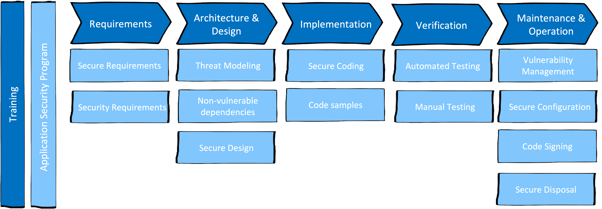

# {{ title }}

This chapter briefly describes the individual building blocks of the DevSecOps principle, each with some examples of tools/standards/methods, etc.

{ width="90%" }

### Food for thought
> Today, we live our lives online. The internet has no geography. It has no borders. By creating the internet, mankind opened up a Pandora’s Box where tangible borders and recognizable enemies ceased to exist.
>
> Mikko Hypponen, Chief Research Officer, F-Secure

## Shift left
What does shift left means?

Security practices and testing are performed **earlier** in the development lifecycle, hence the term shift left can be used.

{ width="90%" }

## DevSecOps building blocks
The different stages in the traditional SDLC must be extended with the security building blocks that are depicted in the following sub chapters.

### Training and Awareness (T&A)
Because security is distributed throughout the **entire development process**, a good understanding of security is required throughout the **entire development team**. T&A is a topic that must be addressed by everyone (engineers, architects, business representatives, ...) across the team and the organization.

Continous training, awareness actions, communication channels and much more are just some of the actions that have to be done in this all over building block.

### Organizational scaling
### Security in planning activities
### Technical security activities
### Deployment pipeline security
### Productive operations and attack response