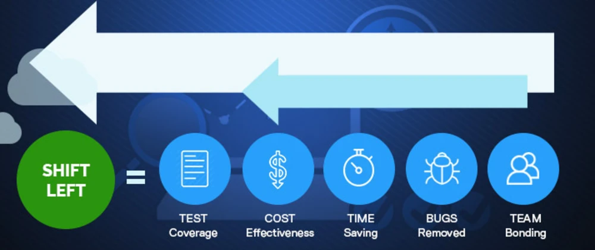
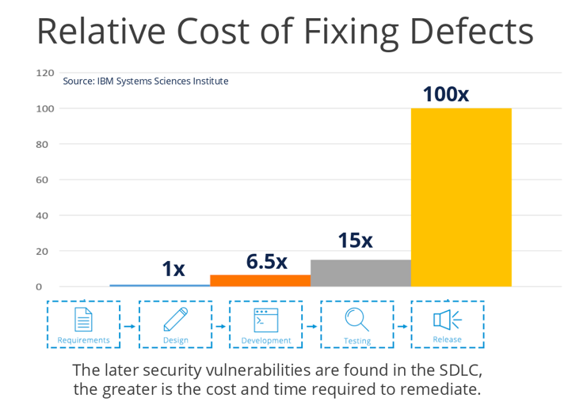

# {{ title }}

This chapter briefly describes the individual building blocks of the DevSecOps principle, each with some examples of tools/standards/methods, etc.

{ width="90%" }

### Food for thought

> Today, we live our lives online. The internet has no geography. It has no borders. By creating the internet, mankind opened up a Pandora’s Box where tangible borders and recognizable enemies ceased to exist.
>
> Mikko Hypponen, Chief Research Officer, F-Secure

## Shift left

What does shift left means?

Security practices and testing are performed **earlier** in the development lifecycle, hence the term shift left can be used.

{ width="90%" }

With the shift left approach, the development cycle will be improved:

- Better test coverage
- Costs will drop
- Time savings are possible
- Bugs are removed early in the process
- Team must work closely together

{ width="70%" }

### Find your vulnerabilities as soon as possible!

The earlier vulnerabilities are found, the easier and less costly they can be remedied. The differences between early and late detection can reach factors of up to 100x. See the following graph (IBM):

{ width="80%" }

## DevSecOps building blocks

The different stages in the traditional SDLC must be extended with the security building blocks that are depicted in the following sub chapters:

- [Training and Awareness](devsecops2.md)
- [Organizational scaling](devsecops3.md)
- [Security in planning activities](devsecops4.md)
- [Technical security activities](devsecops5.md)
- [Deployment pipeline security](devsecops6.md)
- [Productive operations and attack responses](devsecops7.md)

