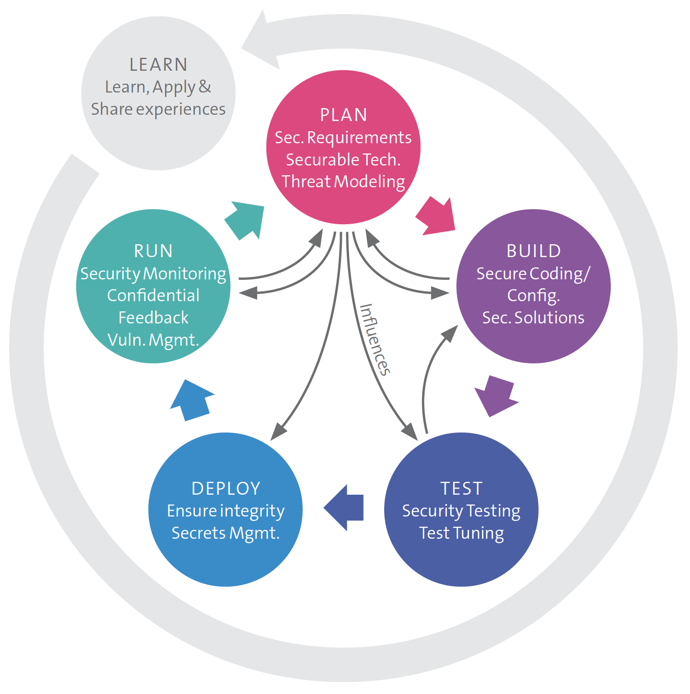

# {{ title }} (Requirements  -  Architecture & Design)

Everything as code is a central principle of DevOps and of course also of DevSecOps. Therefore the creation of code must be **well prepared** and **carefully considered**.

Security activities must take place (in the SSDLC) already in phases like **requirements gathering**, **architecture** and **design**.

!!! information "Security requirements"
    (Security) requirements will come, beside from the functional requirements, from sources like:
    
    - Legal provisions (e.g. GDPR)
    - Compliance (e.g. ISO27001, Finma circular)
    - Handling of data and information according to internal data classification and specifications
    - Customer requirements

Existing sources of security requirements are easy to find out in the Internet (a not complete list):

- [OWASP - ASVS](https://owasp.org/www-project-application-security-verification-standard/)
- [Standard of good practice, ISF](https://www.securityforum.org/services/standard-of-good-practice/)
- [Center of Internet Security (CIS)](https://www.cisecurity.org/)
    - [Control excel](img/CIS_Controls_Version_8.xlsx)
- [Minimum Information Security Requirements for Systems, Applications, and Data - University of Michigan](https://safecomputing.umich.edu/information-security-requirements)

#### Threat modeling

All results obtained in the threat model influence the security activities in subsequent phases of the SSDLC

{ width="70%" }

