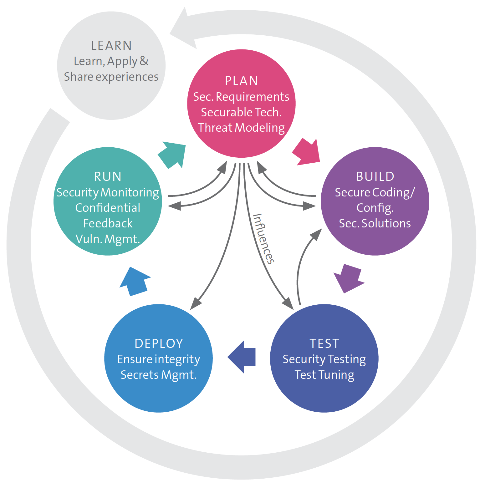

# {{ title }} (Requirements  -  Architecture & Design)

Everything as code is a central principle of DevOps and of course also of DevSecOps. Therefore the creation of code must be **well prepared** and **carefully considered**.

Security activities must take place (in the SSDLC) already in phases like **requirements gathering**, **architecture** and **design**.

!!! information "Security requirements"
    (Security) requirements will come, beside from the functional requirements, from sources like:
    
    - Legal provisions (e.g. GDPR)
    - Compliance (e.g. ISO27001, Finma circular)
    - Handling of data and information according to internal data classification and specifications
    - Customer requirements

Existing sources of security requirements are easy to find out in the Internet (a not complete list):

- [OWASP - ASVS](https://owasp.org/www-project-application-security-verification-standard/)
- [Standard of good practice - ISF](https://www.securityforum.org/solutions-and-insights/standard-of-good-practice-for-information-security/)
- [Center of Internet Security (CIS)](https://www.cisecurity.org/)
    - [CIS Controls Version 8.1](https://www.cisecurity.org/controls/v8-1)
    - [CIS Controls Guide Version 8.1.2 (pdf)](img/CIS-Controls-Guide-v8.1.2.pdf)
    - [Control excel](img/CIS-Controls-8.1.2.xlsx)
- [Minimum Information Security Requirements for Systems, Applications, and Data - University of Michigan](https://safecomputing.umich.edu/information-security-requirements)

#### Threat modeling

All results obtained in the threat model influence the security activities in subsequent phases of the SSDLC:

{ width="70%" }

Threat modeling is a structured approach to identify and analyze potential threats to a system. It helps to understand the attack surface and to prioritize security measures based on the identified risks. Threat modeling can be performed using various methodologies, such as STRIDE, PASTA, or LINDDUN. The most common one is STRIDE, which stands for:

- **S** poofing identity
- **T** ampering with data
- **R** epudiation
- **I** nformation disclosure
- **D** enial of service
- **E** levation of privilege

The OWASP community maintains a [Threat Modeling Process](https://owasp.org/www-community/Threat_Modeling_Process) that can be followed to ensure a systematic approach to threat modeling.
OWASP provides a [Threat Modeling Cheat Sheet](https://cheatsheetseries.owasp.org/cheatsheets/Threat_Modeling_Cheat_Sheet.html) that can be used as a reference for performing threat modeling activities.

##### Tooling for threat modeling
On the OWASP website you can also find a [Threat Modeling Tool](https://owasp.org/www-project-threat-dragon/) that can be used to create and manage threat models.

A good introduction to threat modeling can be viewed in the following video: [STRIDE Threat Modeling for Beginners - In 20 minutes](https://www.youtube.com/watch?v=rEnJYNkUde0)

