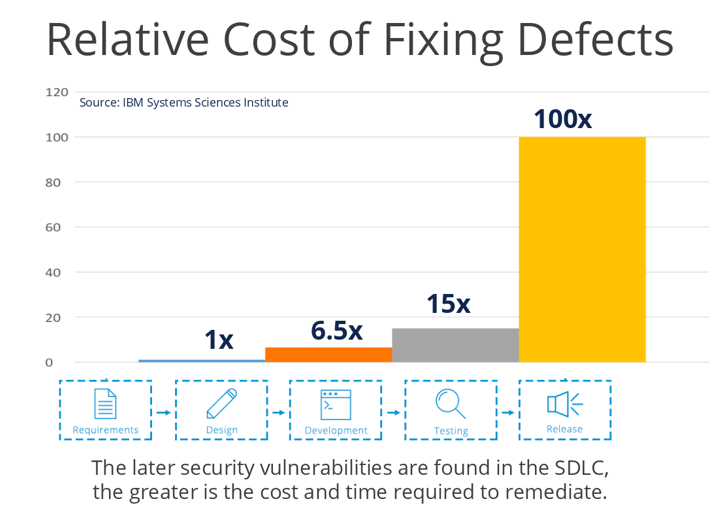
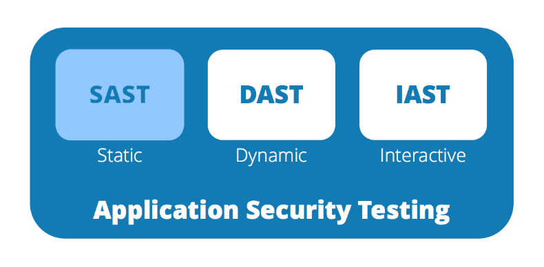

# {{ title }} (Implementation - Verification)

Technical security activities are those steps that are either directly technically feasible or which directly influence the implementation of a product.

Ready-to-use solution help the DevSecOps team to onboard quickly security solutions/tools in the development process and the entire CI/CD pipeline. The DevSecOps team should have a **catalogue** of existing solutions, which finally mitigate threats discovered during the threat modeling. 

!!! information "Security solutions (examples based on STRIDE)"
    - **Authentication**: (multi-factor) authentication as a service that can be integrated into an application
    - **Integrity**: Public Key Infrastructure (PKI) as automated service to enable signing and encryption of artefact and user data
    - **Traceability**: logging solutions that allow for security monitoring
    - **Confidentiality**: Libraries and services for encrypting and accessing sensitive information, such as operational secrets (passwords, SSH keys, certificates, etc .)
    - **Availability**: Libraries and services that can detect and block attacks at the application and network levels
    - **Authorization**: Identity management solutions whose integration allows easy authorization at the application level

### Automated security testing

**Automated** verification of source code and products forms the core of DevSecOps. Automated tests make it possible to quickly detect and eliminate errors.

Thus, **the earlier a defect is discovered, the easier it can be remedied, and the less effort is required.**

{width=90%}

Completely automated deployment pipelines - **including implicit security review and clearance/tollgates** - allow to make security aspects visible during implementation.

==**Automation is key**==, automation of security testing is therefore not only a quality check, but also an instrument for increasing security awareness.

Automated security tests can be used to examine:

- Self-developed source code
- Third-party libraries (e.g. open source libraries)
- Infrastructure (configuration (e.g. unused communications ports), missing updates, weak crypto, unsecure K8s configuration ...) (→ e.g. [Nessus](https://www.tenable.com/products/nessus))

=== "SAST"
    Static Application Security Testing

    - Keywords or combinations of them are searched for that are known to lead to insecure behavior
    - SAST solutions are efficient because they provide a very deep insight into the source code.
    - Advanced analysis tools build graph models from source code, which are then examined for specific patterns
    - Problem of **false positives**

    {width=75%}

=== "DAST"
    Dynamic Application Security Testing

    - Software is executed in a protected environment and called up with security-relevant inputs
    - Inputs can either be formatted sensibly or generated randomly (so-called fuzzing)
    - Depending on how the application behaves or what it returns, vulnerabilities can be identified

    {width=75%}

    During the exercises we will use the [OWASP Zed Attack Proxy (ZAP)](https://www.zaproxy.org/), which you already have seen during the Web-Application Security course.
    
    {width=40%}

#### Manual security testing

Manual security testing is often done at the end of a development or during the operation. The most common type of manual security testing is the **Penetration testing**, where a *good* hacker (a white had) tries to find vulnerabilities. Periodical Audits are also often applied to get a better understanding about the security situation of a productive system.

*This is not part of this lecture.*

