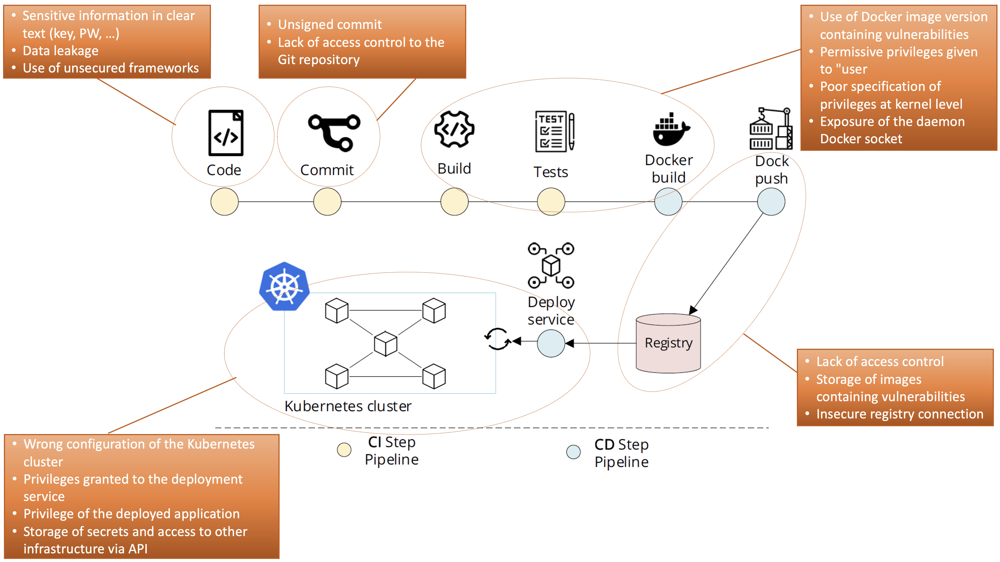

# {{ title }} (Maintenance & Operation)

One of the core capabilities of DevOps organizations is **automation**. Thus **integrity** and **confidentiality of automation services** must always be maintained.

Multiple services in the entire CI/CD pipeline can (or even better must) be automatized:

{width=70%}

However, this is also reflected again with security requirements for these automation services. A segregation of code and configuration data (in a everything-as-code approach (EaC)) is very important to ensure a good security. The configuration data can contain sensitive information like:

- secrets
- API keys
- (prod) data for testing purposes
- information about the environment (IP addresses, DB names, DB tables, etc.)

The EaC means that

- tests
- builds
- repositories
- deployments

are described as code. **Wrong manipulation** of this code can have disastrous implications (e.g. failing tests, ex-filtrated passwords, etc.). This code lies also in the VCS, thus the VCS (and its repos) must be protected as well. **Integrity** and **confidentiality** in the repos must be guaranteed to avoid:

- unwanted changes of code / artefacts
- unauthorized changes of code by unauthorized person
- leakage of *sensitive* data from the repositories

The solution for this is a well-thinked **Identity and Access Management (IAM)** and especially **commit signing** (have a look at this [article](https://betterprogramming.pub/why-and-how-you-should-sign-all-your-git-commits-94435516edae))

!!! important "Awareness"
    Again, a good **Awareness** is key. Authors of code must enforce clean coding rules

    - Reduction of leakage (operational secrets like certs, keys, passwords, etc.)
    - Secret algorithms (intellectual property) must be protected
    - ==**Secrets have no reason to be kept in a VCS!**==

    [Uber data breach, 2016](https://www.theregister.com/2018/02/07/uber_quit_github_for_custom_code_after_2016_data_breach/)

#### Management of secrets and certificates

High degree of automation also depends strongly on an automated **secrets management** (e.g. system to system access), thus in DevSecOps a manual secrets management is not possible!

- Best practice in password management requires regular PW replacement
    - Reduce the risk that attacker can gain access to an old passwords
    - Can be hard in system to system relationships of a big organization
        - A lot of dependencies exists and must be correctly managed
        - Administrator must even sometimes change password manually
        - Hardcoded passwords are therefore very bad
- Use mecanisms like **Vault** (HashiCorp) or **Key Vault** (Azure) to manage secrets, or [Secrets](https://kubernetes.io/docs/concepts/configuration/secret/) in Kubernetes

*Demo of badly used secrets in a pipeline: [playground](https://gitlab.forge.hefr.ch/devsecops/fastapi-redis-k8s-demo)*

Usage of automated PKI is highly recommended

{width=50%}

#### Recap - Security dangers in the CI/CD pipeline

{width=80%}

