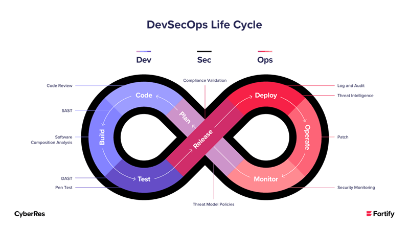

## Objectifs

In this chapter you get an **introduction** about the integration of the security addons for your DevSecOps environment.

## Prerequisits

- Git knowledge
- Base knowledge of Docker
- Usage of command line
- You must understand DevOps
- Capability to create a CI/CD pipeline on GitLab with different stages

## What is DevSecOps?

DevSecOps is the extension of DevOps to ensure a **secure development** and a **secure operation** of the system. So, the **security** part will strech over the entire DevOps livecycle.

Source: fortify.com

To resume the most important points in DevSecOps, we have:

- General awareness - training program
- Intrinsic security - make security as simple and accessible as possible
- Identity & Access management - mapping of all DevSecOps roles and having the processes
- Organization - Security is anchored in the DevSecOps organization. Responsibility for risks and vulnerabilities
- Automation, automation and, automation

**Efficient security in a DevSecOps organization is primarily characterized by the strong integration of the various security activities**. The better the individuals steps are linked, the more effectively security can be implemented. 

Thus the DevSecOps approach helps to achieve this goal.

## MSE Slide Deck on DevSecOps
The following online slide deck will be used for this lecture and is freely available for getting additional information and insights about this fascinating topic: [TSM_Cybersecurity DevSecOps](https://heia-fr-maeder.github.io/mse_cybersec/#/1)