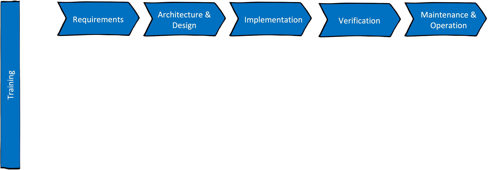

## Let's start with a glimpse of the SSDLC

SSDLC stands for **Secure** Software Development Livecycle. It describes how an application should be designed, written, tested, deployed and finally securely operated. 

The standard SDLC looks like this:

{ width="60%" }

In a chronological representation it looks like this:

{ width="90%" }

## The secure way of SDLC
To add now the security aspects to the SDLC, we would extend for each of the steps (which can of course be iterated over and over again to represent and agil approach) different security points:

{ width="90%" }

### Additional resources
The DevSecOps handbook [DevSecOps - dynamic, fast, efficient and secure](https://www.swisscom.ch/content/dam/swisscom/en/about/company/portrait/network/security/documents/devsecops-dynamic-fast-effective-and-secure.pdf) provides a lot of additional information.