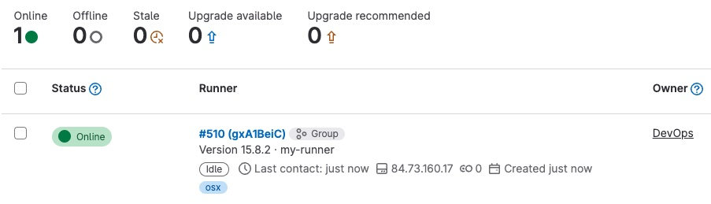

## Workflows complexes

Dans les chapitres précédents, nous avons mis l'accent sur la création
d'images Docker multi-architecture et la configuration du CI/CD était
plutôt simple.

Dans la pratique, le fichier ".gitlab-ci.yaml" est beaucoup plus
long et le _workflow_ plus complexe. Il y aura plusieurs phases
([stages](https://docs.gitlab.com/ee/ci/yaml/index.html#stages)) et dans
chaque phase il y aura plusieurs tâches
([jobs](https://docs.gitlab.com/ee/ci/yaml/index.html#job-keywords))
Certaines tâches se feront dans des conditions données
([only/except](https://docs.gitlab.com/ee/ci/yaml/index.html#only--except)
et [rules](https://docs.gitlab.com/ee/ci/yaml/index.html#rules)). Par
exemple, on ne fera pas la même chose si il y a un nouveau tag dans le
dépôt git, si le CI/CD est lancé suite à un _merge request_ ou si on
fait un _commit_ dans la branche _main_.

Jetez un coup d'œil au [fichier de configuration du dépôt de GitLab
lui-même](https://gitlab.com/gitlab-org/gitlab/-/blob/master/.gitlab-ci.yml)
pour vous en faire une idée. Et si ça vous semble peu, regardez les
dernières lignes qui importent le contenu du répertoire.
[`.gitlab/ci`](https://gitlab.com/gitlab-org/gitlab/-/tree/master/.gitlab/ci)

Pour maîtriser le CI/CD de GitLab, il est important que cous compreniez
le concept
d'[artifact](https://docs.gitlab.com/ee/ci/pipelines/job_artifacts.html)
et que vous sachiez utiliser les
[caches](https://docs.gitlab.com/ee/ci/caching/) efficacement.

## Liens

Étudiez le contenu de ces liens pour apprendre comment utiliser
le CI/CD de GitLab efficacement :

- https://docs.gitlab.com/ee/ci/
- https://docs.gitlab.com/ee/ci/yaml/index.html
- https://about.gitlab.com/topics/ci-cd/continuous-integration-best-practices/
- https://about.gitlab.com/blog/2022/02/03/how-to-keep-up-with-ci-cd-best-practices/
  

## Votre propre Runner

Les _runners_ partagés dans le réseau de l'école sont dans un cluster
Kubernetes et permettent de faire la plupart des choses, mais parfois
vous avez besoin de votre propre runner. C'est principalement dans les
cas suivants :

- Vous avez besoin de matériel spécifique (GPU, matériel réseau ...)
- Vous devez connecter d'autres systèmes (programmation de systèmes embarqués ...)
- Vous avez besoin de plus de ressources (CPUs plus rapides, plus de RAM ...)
- Vous avez besoin d'une architecture différente (Apple, ARM ...)

Votre Docker peut être affecté à un projet donné ou à un groupe. Faisons un exemple
avec un groupe.

Commencez par démarrer un _runner_ sur votre machine à l'aide d'une image Docker.
Créez tout d'abord un volume pour sauvegarder la configuration :

``` bash
docker volume create gitlab-runner-config
```

Démarrez maintenant le _runner_ :

``` bash
docker run -d --name gitlab-runner --restart always \
    -v /var/run/docker.sock:/var/run/docker.sock \
    -v gitlab-runner-config:/etc/gitlab-runner \
    gitlab/gitlab-runner:latest
````

Dans votre groupe allez dans "CI/CD" --> "Runners" et 
cliquez sur "Register a group runner". Vous obtiendrez
un "Registration token".

Enregistrez votre _runner_ :

``` bash
docker run --rm -it -v gitlab-runner-config:/etc/gitlab-runner gitlab/gitlab-runner:latest register
```

et répondez aux questions :

``` text hl_lines="2 4 6 8 11 13"
Enter the GitLab instance URL (for example, https://gitlab.com/):
https://gitlab.forge.hefr.ch/
Enter the registration token:
YOUR-REGISTRATION-TOKEN
Enter a description for the runner:
[SOME-HEXADECIMAL-VALUE]: my-runner
Enter tags for the runner (comma-separated):
osx
Registering runner... succeeded
Enter an executor: docker, shell, ssh, docker+machine, instance, kubernetes, custom, docker-ssh, parallels, virtualbox, docker-ssh+machine:
docker
Enter the default Docker image (for example, ruby:2.7):
python:3
Runner registered successfully. Feel free to start it, but if it's running already the config should be automatically reloaded!

Configuration (with the authentication token) was saved in "/etc/gitlab-runner/config.toml"
```

Votre _runner_ est fonctionnel et apparaît dans l'interface web

<figure markdown>

</figure>

Pour l'utiliser, spécifiez un
[tag](https://docs.gitlab.com/ee/ci/yaml/index.html#tags) que vous avez
configuré (`osx` dans l'exemple ci-dessus) dans votre fichier
".gitlab-ci.yml"

Vous pouvez supprimer votre runner avec les commandes suivantes :

``` bash
docker rm --force gitlab-runner
docker volume rm gitlab-runner-config
```

Supprimez aussi le _runner_ de votre groupe dans l'interface web.
