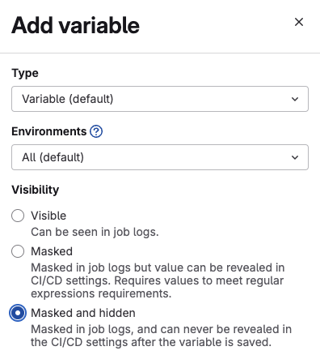
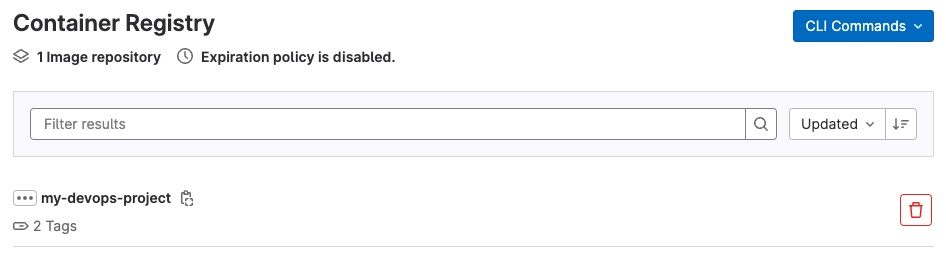

## Commençons avec un programme simple

Pour illustrer ce chapitre, commençons par un programme en Go qui affiche
un message de bienvenue, ainsi que quelques informations sur votre système.

Créez un nouveau dossier et ajoutez-y ces deux fichiers "go.mod" et "hello-devops.go" :

``` text title="go.mod"
module hello-devops

go {{ go_version }}
```

``` Go title="hello-devops.go"
package main

import (
        "fmt"
        "runtime"
)

func main() {
        fmt.Println("Hello DevOps!")
        fmt.Println("Go version:", runtime.Version())
        fmt.Println("Architecture:", runtime.GOARCH)
        fmt.Println("OS:", runtime.GOOS)
}
```

Pour vérifier que tout fonctionne correctement, vous pouvez compiler ces programmes
sur votre machine. Si ce n'est pas encore fait, [téléchargez l'environnement de développement
Go](https://go.dev/dl/) et [installez-le](https://go.dev/doc/install) sur votre machine.

Tapez maintenant la commande suivante dans un terminal :

``` bash
go run .
```

et vous devriez obtenir quelque chose qui ressemble à ça :

``` text
Hello DevOps!
Go version: go{{ go_version }}
Architecture: amd64 (ou arm64)
OS: windows (ou linux, ou darwin)
```

Bravo! Vous avez écrit un programme en Go!

## Containairisation du programme

Mais si vous n'aviez pas envie (ou si vous ne pouviez pas) installer l'environnement
de développement Go, vous auriez aussi pu exécuter ce programme en passant par une
image Docker. C'est ce que nous allons faire maintenant.

Créez un fichier "Dockerfile" dans le même dossier :

``` Dockerfile title="Dockerfile"
FROM golang:{{ go_major_version }} AS builder
WORKDIR /app
COPY go.mod hello-devops.go ./
RUN go build .

FROM alpine:{{ alpine_version }}
WORKDIR /root/
COPY --from=builder /app/hello-devops /usr/local/bin/hello-devops
CMD ["/usr/local/bin/hello-devops"]
```

!!! warning "Attention"
    Dans le `Dockerfile` ci-dessus, nous téléchargeons les images du
    "registry" DockerHub. Pour des téléchargements anonymes, Dockerhub
    impose une [limite de 10
    téléchargements](https://docs.docker.com/docker-hub/download-rate-limit/#whats-the-download-rate-limit-on-docker-hub)
    par adresse IP et par heure! Si vous ploquez votre propre adresse
    IP, vous ne pourrez plus télécharger d'images Docker depuis
    DockerHub, mais les _dégâts_ ne toucheront que votre propre adresse
    IP. Par contre, si vous bloquez l'adresse IP des serveurs de
    l'école, vous bloquerez tout le monde pendant une heure!

Pour s'adapter à la limite imposée par DockerHub, nous commençons par
créer un compte sur DockerHub. Rendez-vous sur
[DockerHub](https://hub.docker.com/) et créez un compte. Si le site vous
demande de choisir entre un compte _Work_ ou _Personal_, choisissez
_Personal_.


Dès que vous avez créé votre compte, vous pouvez vous authentifier avec
la commande suivante:

``` bash
docker login
```

Suivez les instructions et vous devriez voir un message du genre :

``` text
Login Succeeded
```

Losque vous êtes authentifié, vous avez droit à 40 téléchargements par heure (et par utilisateur).

!!! Note "Note"
    Une autre manière de contourner la limite imposée par Dockerhub consiste à simplement utiliser un autre "registry" comme le [Public Elastic Container Registry d'Amazone](https://gallery.ecr.aws/).

!!! Note "Note"
    Les "runners" de l'école utilisent un cache pour les images Docker provenant de DockerHub,
    mais lorsque nous utilisons Docker à l'itérieur de Docker (DinD), le cache n'est pas utilisé


construisez maintenant une image Docker :

``` bash
docker build -t hello-devops .
```

et exécutez-la :

``` bash
docker run --rm hello-devops
```

Vous obtenez quelque chose comme ça :

``` text
Hello DevOps!
Go version: go{{ go_version}}
Architecture: arm64
OS: linux
```

l'architecture est la même que votre machine (amd64 ou arm64), mais l'OS est
maintenant "linux", car le container fonctionne bien dans un environnement Linux.

## Utilisation du CI/CD

Jusqu'ici, nous avons fait toutes les opérations sur
notre ordinateur personnel. Il est temps de passer au CI/CD
et laisser les ordinateurs du _cloud_ faire le travail.

Ajoutez le fichier ".gitlab-ci.yml" à votre dossier :

``` yaml title=".gitlab-ci.yml" linenums="1"
image: docker:{{ docker_version }}

services:
  - docker:{{ docker_version }}-dind

variables:
  IMAGE_TAG_SLUG: $CI_REGISTRY_IMAGE:$CI_COMMIT_REF_SLUG
  IMAGE_TAG_LATEST: $CI_REGISTRY_IMAGE:latest

before_script:
  - docker info
  - docker login -u $DOCKERHUB_USER -p $DOCKERHUB_TOKEN

build:
  stage: build
  script:
    - docker build -t $IMAGE_TAG_LATEST .
    - docker tag $IMAGE_TAG_LATEST $IMAGE_TAG_SLUG
    - docker login -u $CI_REGISTRY_USER -p $CI_REGISTRY_PASSWORD $CI_REGISTRY
    - docker push $IMAGE_TAG_SLUG
    - docker push $IMAGE_TAG_LATEST
```

!!! note "Note"
    le service `docker:{{ docker_version }}-dind` (dind = Docker-in-Docker) permet de faire
    tourner du Docker dans du Docker.

    Le Service Informatique recommandait l'utilisation de [Kaniko](https://docs.gitlab.com/ee/ci/docker/using_kaniko.html)
    pour la création d'image Docker. Cependant, Kaniko n'est pas encore capable
    de faire des images multi-architectures et c'est pourquoi nous ne l'utilisons
    pas ici. La [documentation](https://docs.gitlab.com/ee/ci/docker/using_kaniko.html#build-a-multi-arch-image)
    fait mention d'un "manifest-tool" pour construire les images multi-architectures, mais
    je trouve que c'est un peu compliqué et je préfère la méthode que je vais vous
    montrer dans le chapitre suivant.

Avec ce fichier, vous indiquez à GitLab ce qu'il doit faire quand une nouvelle
version est _poussée_ (push) dans le dépôt.

Si ce n'est pas déjà fait, créez un dépôt dans le GitLab de l'école et mettez-y
tous les fichiers que vous venez de créer.

Afin d'utiliser votre compte DockerHub dans le CI/CD, vous devez encore obtenir un token pour DockerHub.
Connectez-vous à votre compte sur DockerHub et cliquez sur votre _login name_ en haut à droite, puis sur _Account Settings_

<figure markdown>

</figure>

Dans la section _Personal access tokens_, créez un nouvel _Access Token_ avec le _scope_ "Read, Write, Delete".

<figure markdown>

</figure>

!!! Note
    Si vous souhaitez uniquement lire les images publiques, vous pouvez choisir le _scope_ "Public Repo Read-only",
    mais plus tard nous allons publier notre image dans DockerHub et pour cela, nous avons besoin du _scope_ "Read, Write, Delete".
    Je vous recommande donc de choisir ce _scope_ dès le début, mais d'un point de vue de la sécurité, il est préférable de
    choisir le _scope_ le plus bas possible.

A la ligne 12 du fichier `.gitlab-ci.yml`, ci-dessus, les deux variables d'environnement `$DOCKERHUB_USER` et `$DOCKERHUB_TOKEN`.
doivent contenir le _user name_ et l'_Access Token_ que vous venez de créer. Définissez ces variables dans votre projet GitLab :

Allez dans
"Settings" --> "CI/CD" --> "Variables" et ajoutez ces deux variables. Pour plus de sécurité, protégez le contenu de ces
variables en cochant la case _Masked and hidden_. Notez que pour `$DOCKERHUB_USER`, vous pouvez vous contenter de protéger cette variable
avec l'option _Masked_.

<figure markdown>

</figure>


Après avoir synchronisé votre dépôt (avec `git push`), vous devriez voir une nouvelle
entrée dans la section "CI/CD" --> "Pipelines" :

<figure markdown>
{: width="650" }
</figure>

Vous devriez aussi avoir une entrée dans "Deploy" --> "Container registry".

<figure markdown>

</figure>

Vous pouvez télécharger et exécuter cette image avec la commande :

``` bash
docker run --rm registry.forge.hefr.ch/<NAMESPACE>/<REPOSITORY>
```

!!! info "Info"
    Si votre projet est privé, vous devrez probablement vous authentifier avant
    de pouvoir utiliser l'image :

    ```bash
    docker login registry.forge.hefr.ch
    ```

et vous devriez obtenir ceci :

``` text
Hello DevOps!
Go version: go{{ go_version}}
Architecture: amd64
OS: linux
```

L'architecture sera toujours _amd64_ car le _runner_ qui a compilé votre
programme dans GitLab est une machine avec une architecture _amd64_
et si vous faites tourner cette image sur un Mac récent (avec une puce ARM),
vous observerez le message suivant:

``` text
WARNING: The requested image's platform (linux/amd64) does not match
the detected host platform (linux/arm64/v8) and no specific platform
was requested
```