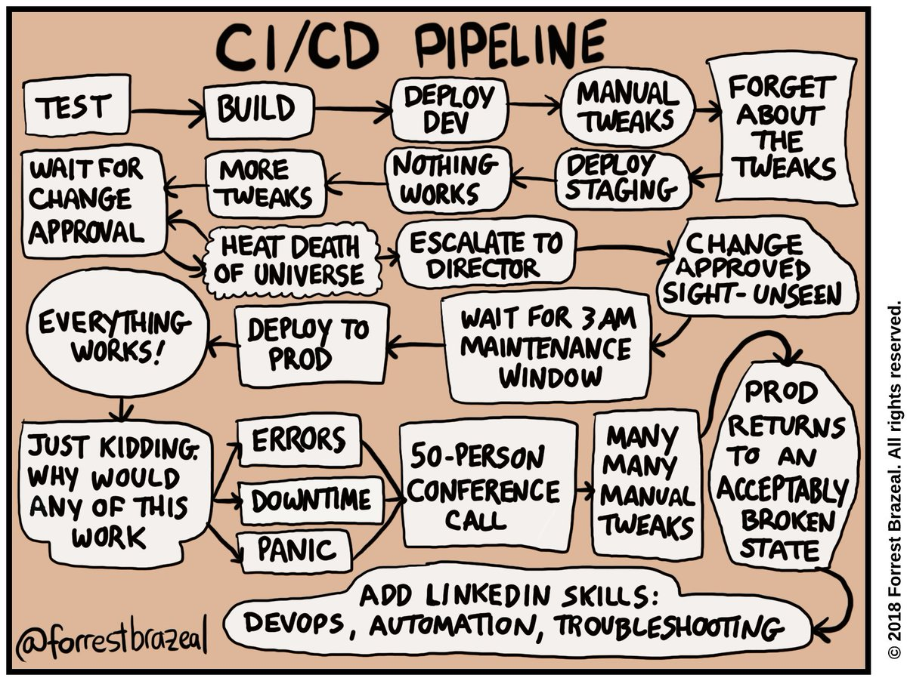

# {{ title }}

Dans ce chapitre, nous avons étudié les possibilités que nous offre GitLab
pour mettre en pratique le CI/CD. Nous avons aussi vu les limites, surtout
pour la création d'images multi-architectures.

Pour les exercices de ce chapitre, nous avons utilisé les _runners_ (les machines qui fait tourner les tâches du CI/CD) de l'école. Fitlab - tout comme Github - vous permet de créer vos propres _runners_ et de les utiliser pour vos projets. C'est une option intéressante si vous avez besoin de plus de puissance de calcul ou si vous avez des besoins spécifiques (par exemple des GPUs ou des machines avec des architectures différentes).

Dans le chapitre suivant, vous apprendrez à utiliser les outils offerts
par GitHub. Il s'agit principalement des "GitHub Actions" et vous
apprendrez à maitriser cet outil très puissant.

Dans tous les cas, utilisez
le CI/CD et les tests unitaires pour tous vos projets; faites en sorte
que ça devienne une habitude. Vous serez fier de montrer des dépôts Git
de qualité et votre futur employeur sera convaincu que vous connaissez
les bonnes pratiques du développement informatique.

<figure markdown>

</figure>