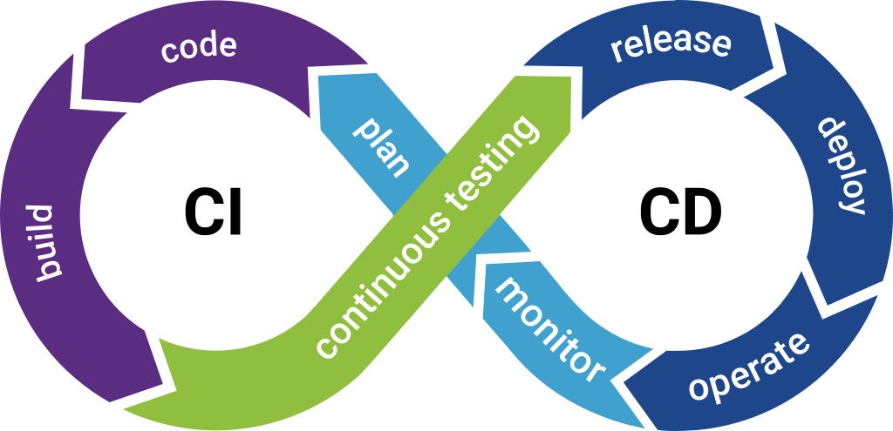
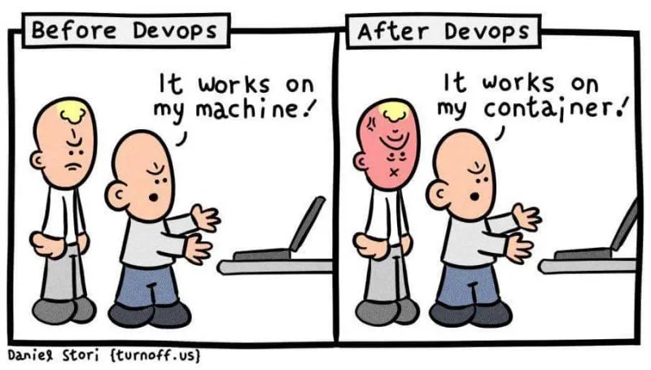

## Objectifs

Dans ce chapitre, vous apprendrez à construire et à déployer automatiquement une image Docker.

## Prérequis

- Connaissance de Git
- Connaissance de base de Docker
- Utilisation de la ligne de commande

## Qu'est ce que le CI/CD ?

Le CI/CD (Continuous Integration / Continuous Delivery) est une pratique
de développement logiciel qui consiste à automatiser la compilation,
les tests et le déploiement d'une application ou d'un service.

Les avantages principaux sont les suivants :

- Les tâches fastidieuses et longues sont automatisées
- Chaque modification de code est validée par les tests unitaires
- L'environnement de compilation est standardisé (plus de "It works on my machine")

Le processus de CD (Continuous Delivery ou Continuous Deployment)
intervient après le CI. Il consiste à automatiser le processus de
déploiement des nouvelles versions de l'application sur les serveurs de
production. Le CD peut aussi déployer des pages web, du firmware pour
des systèmes embarqués ou des images Docker.
