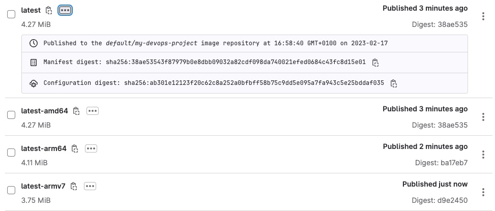
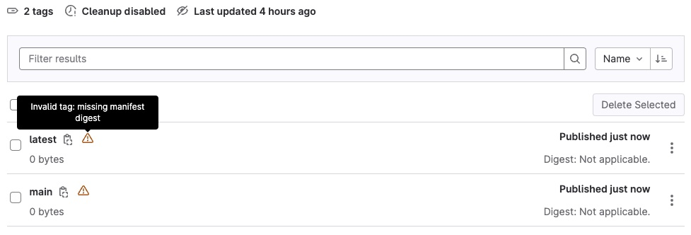
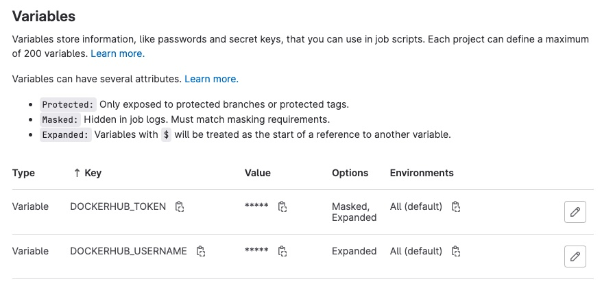
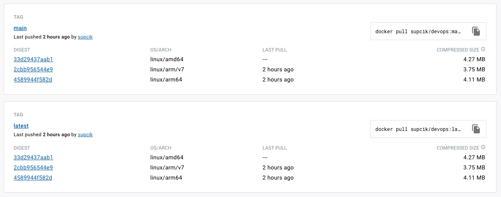

## Il n'y a pas que des puces Intel dans les ordinateurs

Aujourd'hui, nous ne pouvons pas ignorer les ordinateurs avec des
architectures autres que _amd64_ (Intel). Le Raspberry Pi est
un mini-ordinateur très populaire et il fonctionne avec un microprocesseur
ARM. Tous les nouveaux Macbooks sont maintenant livrés avec un
processeur basé sur la technologie ARM. Bien que ces Macs peuvent
faire tourner des images Docker faites pour _amd64_ grâce à un
émulateur, ça reste une solution peu performante.

Nous allons donc modifier notre projet pour que le _runner_ produise
également une image ARM.

Modifiez le fichier ".gitlab-ci.yml" avec ce contenu:

``` yaml title=".gitlab-ci.yml"
image: public.ecr.aws/docker/library/docker:19.03.15

services:
  - public.ecr.aws/docker/library/docker:19.03.15-dind

variables:
  IMAGE_TAG_SLUG: $CI_REGISTRY_IMAGE:$CI_COMMIT_REF_SLUG
  IMAGE_TAG_LATEST: $CI_REGISTRY_IMAGE:latest
  DOCKER_CLI_EXPERIMENTAL: enabled

before_script:
  - docker info
  - docker login -u $CI_REGISTRY_USER -p $CI_REGISTRY_PASSWORD $CI_REGISTRY

build:
  stage: build
  script:
    - mkdir -p /usr/local/lib/docker/cli-plugins
    - wget https://github.com/docker/buildx/releases/download/v0.10.3/buildx-v0.10.3.linux-amd64 -O /usr/local/lib/docker/cli-plugins/docker-buildx
    - chmod a+x /usr/local/lib/docker/cli-plugins/docker-buildx
    - docker buildx ls
    - docker buildx build --push --platform linux/amd64 --tag "${IMAGE_TAG_SLUG}-amd64" .
    - docker buildx build --push --platform linux/arm64 --tag "${IMAGE_TAG_SLUG}-arm64" .
    - docker buildx build --push --platform linux/arm/v7 --tag "${IMAGE_TAG_SLUG}-armv7" .
    - docker manifest create ${IMAGE_TAG_SLUG} "${IMAGE_TAG_SLUG}-amd64" "${IMAGE_TAG_SLUG}-arm64" "${IMAGE_TAG_SLUG}-armv7"
    - docker manifest push ${IMAGE_TAG_SLUG}
    - docker buildx build --push --platform linux/amd64 --tag "${IMAGE_TAG_LATEST}-amd64" .
    - docker buildx build --push --platform linux/arm64 --tag "${IMAGE_TAG_LATEST}-arm64" .
    - docker buildx build --push --platform linux/arm/v7 --tag "${IMAGE_TAG_LATEST}-armv7" .
    - docker manifest create ${IMAGE_TAG_LATEST} "${IMAGE_TAG_LATEST}-amd64" "${IMAGE_TAG_LATEST}-arm64" "${IMAGE_TAG_LATEST}-armv7"
    - docker manifest push ${IMAGE_TAG_LATEST}
```

Faites un _commit_ puis in _push_ et observez le résultat dans l'interface web de GitHub. Notez que le _runner_
prend plus de temps pour construire les images, car maintenant c'est lui qui doit émuler le processeur ARM.
Après environ 3 minutes le résultat devrait être disponible et vous devriez avoir 4 les 4 _tags_ suivants :

<figure markdown>

</figure>

Téléchargez la nouvelle image et refaites un essai :

``` bash
docker pull registry.forge.hefr.ch/<NAMESPACE>/<REPOSITORY>
docker run --rm registry.forge.hefr.ch/<NAMESPACE>/<REPOSITORY>
```

et si vous avez une machine avec un processeur ARM, vous verrez la bonne
architecture et pas de message de type _warning_ :

``` text
Hello DevOps!
Go version: go1.20.1
Architecture: arm64
OS: linux
```

## Une seule image "multi-architecture"

Dans la section précédente, nous avons construit une image _multi-architectures_
à l'aide de plusieurs images et d'un _manifest_ et c'est la méthode recommandée
pour travailler avec le _registry_ de GitLab. Mais avec un docker récent, nous
pouvons directement faire une image multi-architectures.

Pour garder une version fonctionnelle sur Gitlab, faites maintenant un nouveau 
projet avec les fichiers "Dockerfile", "go.mod" et "hello-devops.go" et
déployez ce projet sur Gitlab.

Ajoutez le fichier ".gitlab-ci.yml" suivant:

``` yaml title=".gitlab-ci.yml"
image: public.ecr.aws/docker/library/docker:19.03.15

services:
  - public.ecr.aws/docker/library/docker:19.03.15-dind

variables:
  IMAGE_TAG_SLUG: $CI_REGISTRY_IMAGE:$CI_COMMIT_REF_SLUG
  IMAGE_TAG_LATEST: $CI_REGISTRY_IMAGE:latest

before_script:
  - docker info
  - docker login -u $CI_REGISTRY_USER -p $CI_REGISTRY_PASSWORD $CI_REGISTRY

build:
  stage: build
  script:
    - mkdir -p /usr/local/lib/docker/cli-plugins
    - wget https://github.com/docker/buildx/releases/download/v0.10.3/buildx-v0.10.3.linux-amd64 -O /usr/local/lib/docker/cli-plugins/docker-buildx
    - chmod a+x /usr/local/lib/docker/cli-plugins/docker-buildx
    - docker buildx create --use
    - docker buildx ls
    - docker buildx build --platform linux/amd64,linux/arm64,linux/arm/v7 -t $IMAGE_TAG_SLUG -t$IMAGE_TAG_LATEST  --push .
```

Après avoir syncronisé votre dépôt, le CI/CD construira l'image multi-architectures et la publiera
dans le _registry_ de GitLab (Package and Registries --> Container Registry). Mais l'interface web de
GitLab aura de la peine avec cette image :

<figure markdown>

</figure>

Par contre l'image fonctionne très bien et vous pouvez l'utiliser comme dans la section précédente.

## Publication de l'image dans le DockerHub

Jusqu'à maintenant, nous avons publié les images dans le _registry_ de GitLab. Mais ce n'est
pas la seule option et vous pouvez publier votre image dans d'autres registries publiques tels que :

- Docker Hub
- Canister.io
- GitHub
- AWS Container Registry
- Google Container Registry

Docker Hub est le plus populaire et nous allons y publier notre image. Si ce n'est pas déjà
fait, créez un compte sur https://hub.docker.com/ et connectez-vous.

Cliquez sur votre _login name_ en haut à droite, puis sur _Account Settings_

<figure markdown>

</figure>

Dans la section _Security_, créez un nouvel _Access Token_ avec le _scope_ "Read, Write, Delete" et
Notez-le quelque part.

Retournez dans votre projet sur GitLab et dans la barre de gauche, choisissez _Settings_ --> _CI/CD_.
Développez la section _Variables_ et créez les deux variables "DOCKERHUB_TOKEN" et "DOCKERHUB_USERNAME"

<figure markdown>

</figure>

"DOCKERHUB_TOKEN" est l'_Access Token_ que vous venez de créer et "DOCKERHUB_USERNAME" est
votre _user name_ sur Docker Hub. Protégez le "DOCKERHUB_TOKEN" en cochant la case _Mask variable_

!!! warning "Attention"
    GitLab masque le contenu de la variable "DOCKERHUB_TOKEN" dans les logs, mais les administrateurs de
    votre dépôt peuvent voir son contenu. Soyez-en conscient!

Remplacez le contenu du fichier ".gitlab-ci.yml" par ceci :

```yaml title=".gitlab-ci.yml"
image: public.ecr.aws/docker/library/docker:19.03.15

services:
  - public.ecr.aws/docker/library/docker:19.03.15-dind

variables:
  DOCKERHUB_PROJECT: devops
  IMAGE_TAG_LATEST: ${DOCKERHUB_USERNAME}/${DOCKERHUB_PROJECT}:latest
  IMAGE_TAG_SLUG: ${DOCKERHUB_USERNAME}/${DOCKERHUB_PROJECT}:${CI_COMMIT_REF_SLUG}

before_script:
  - docker info
  - docker login -u $DOCKERHUB_USERNAME -p $DOCKERHUB_TOKEN

build:
  stage: build
  script:
    - mkdir -p /usr/local/lib/docker/cli-plugins
    - wget https://github.com/docker/buildx/releases/download/v0.10.3/buildx-v0.10.3.linux-amd64 -O /usr/local/lib/docker/cli-plugins/docker-buildx
    - chmod a+x /usr/local/lib/docker/cli-plugins/docker-buildx
    - docker buildx create --use
    - docker buildx ls
    - docker buildx build --platform linux/amd64,linux/arm64,linux/arm/v7 -t $IMAGE_TAG_LATEST -t $IMAGE_TAG_SLUG --push .
```

Remplacez la variable `DOCKERHUB_PROJECT` par le nom de votre repository sur Docker Hub et mettez à
jour le dépôt sur GitLab.

Dès que le _runner_ aura fait son travail, vous devriez avoir l'image multi-architectures dans votre compte
Docker Hub avec les tags et les architectures :

<figure markdown>

</figure>

L'image sur mon compte Docker Hub est publique et vous pouvez l'essayer sans autre
avec la commande suivante :

``` bash
docker run --rm supcik/devops
```
