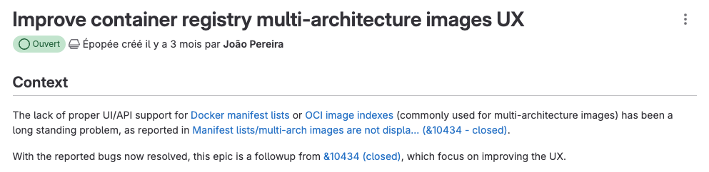
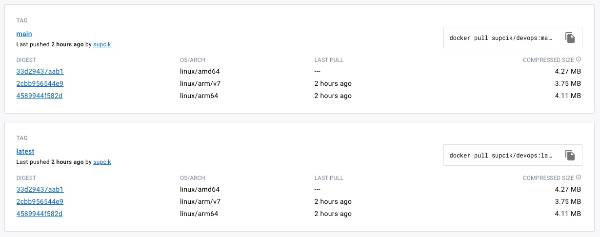

## Il n'y a pas que des puces Intel dans les ordinateurs

Aujourd'hui, nous ne pouvons pas ignorer les ordinateurs avec des
architectures autres que _amd64_ (Intel). Le Raspberry Pi est
un mini-ordinateur très populaire et il fonctionne avec un microprocesseur
ARM. Tous les nouveaux Macbooks sont maintenant livrés avec un
processeur basé sur la technologie ARM. Bien que ces Macs peuvent
faire tourner des images Docker faites pour _amd64_ grâce à un
émulateur, ça reste une solution peu performante.

Nous allons donc modifier notre projet pour que le _runner_ produise
également une image ARM.

Modifiez le fichier ".gitlab-ci.yml" en y ajoutant la ligne 35 avec l'option `--opt platform=linux/amd64,linux/arm64` :

``` yaml title=".gitlab-ci.yml" linenums="1" hl_lines="35"
build-multiarch-docker-image:
  image:
    name: moby/buildkit:rootless
    entrypoint: [""]
  stage: build
  variables:
    BUILDKITD_FLAGS: --oci-worker-no-process-sandbox
    DOCKER_CONFIG: "$CI_PROJECT_DIR/.docker"
    CACHE_IMAGE: $CI_REGISTRY_IMAGE:cache
    IMAGE_TAG_SHA: $CI_REGISTRY_IMAGE:$CI_COMMIT_SHA
    IMAGE_TAG_LATEST: $CI_REGISTRY_IMAGE:latest
  before_script:
    - mkdir -p "$DOCKER_CONFIG"
    - |
      echo "{
        \"auths\": {
          \"${CI_REGISTRY}\": {
            \"auth\": \"$(printf "%s:%s" "${CI_REGISTRY_USER}" "${CI_REGISTRY_PASSWORD}" | base64 | tr -d '\n')\"
          },
          \"https://index.docker.io/v1/\": {
            \"auth\": \"$(printf "%s:%s" "${DOCKER_HUB_USER}" "${DOCKER_HUB_PASSWORD}" | base64 | tr -d '\n')\"
          }
        }
      }" > "$DOCKER_CONFIG/config.json"
  script:
    - |
      # Use git tag if available, otherwise use branch name (preserves dots in tags)
      TAG_NAME=${CI_COMMIT_TAG:-$CI_COMMIT_REF_NAME}
      buildctl-daemonless.sh build \
        --frontend dockerfile.v0 \
        --local context=. \
        --local dockerfile=. \
        --export-cache type=registry,ref=$CACHE_IMAGE \
        --import-cache type=registry,ref=$CACHE_IMAGE \
        --opt platform=linux/amd64,linux/arm64 \
        --output type=image,\"name=$IMAGE_TAG_SHA,$IMAGE_TAG_LATEST,$CI_REGISTRY_IMAGE:$TAG_NAME\",push=true

```

Faites un _commit_ puis in _push_ et observez le résultat du _pipeline_ dans l'interface web de GitHub. Notez que le _runner_
prend plus de temps pour construire les images, car maintenant c'est lui qui doit émuler le processeur ARM.
Après environ 3 minutes le résultat devrait être disponible dans le _registry_ de GitLab.

Téléchargez la nouvelle image et refaites un essai :

``` bash
docker pull registry.forge.hefr.ch/<NAMESPACE>/<REPOSITORY>:latest
docker run --rm registry.forge.hefr.ch/<NAMESPACE>/<REPOSITORY>:latest
```

et si vous avez une machine avec un processeur ARM, vous verrez la bonne
architecture et pas de message de type _warning_ :

``` text
Hello DevOps!
Go version: go{{ go_version}}
Architecture: arm64
OS: linux
```

Si votre machine est capable de faire tourner des images pour les deux architectures, vous pouvez aussi faire tourner l'image pour les deux architectures et observer le résultat :

``` bash
docker run --platform=linux/amd64 --rm registry.forge.hefr.ch/<NAMESPACE>/<REPOSITORY>:latest
docker run --platform=linux/arm64 --rm registry.forge.hefr.ch/<NAMESPACE>/<REPOSITORY>:latest
```

Notez que l'interface web de Gitlab ne montre pas les différentes architectures disponibles pour une image.
Il y a actuellement un [epic](https://gitlab.com/groups/gitlab-org/-/epics/11952) ouvert pour addresser ce problème:

<figure markdown>

</figure>

En attendant, vous pouvez vérifier les différentes architectures disponibles pour une image avec la commande suivante :


``` bash
docker manifest inspect <NAMESPACE>/<REPOSITORY>:latest
```

Vous devriez obtenir quelque chose comme ça :

``` json
{
   "schemaVersion": 2,
   ...
   "manifests": [
      {
         ...
         "platform": {
            "architecture": "amd64",
            "os": "linux"
         }
      },
      {
         ...
         "platform": {
            "architecture": "arm64",
            "os": "linux"
         }
      }
   ]
}
```

## Publication de l'image dans le DockerHub

Jusqu'à maintenant, nous avons publié les images dans le _registry_ de GitLab. Mais ce n'est
pas la seule option et vous pouvez publier votre image dans d'autres registries publiques tels que :

- Docker Hub
- Canister.io
- GitHub
- AWS Container Registry
- Google Container Registry

Docker Hub est le plus populaire et nous allons y publier notre image.
Précédement, vous avez déjà défini les variables `$DOCKER_HUB_USER` et `$DOCKER_HUB_TOKEN`
et le _token_ que vous avez généré vous donne déjà les bonnes permissions pour publier.


Remplacez le contenu du fichier ".gitlab-ci.yml" par ceci :

```yaml title=".gitlab-ci.yml"
build-docker-image-to-dockerhub:
  image:
    name: moby/buildkit:rootless
    entrypoint: [""]
  stage: build
  variables:
    DOCKER_HUB_PROJECT: "devops"
    BUILDKITD_FLAGS: --oci-worker-no-process-sandbox
    DOCKER_CONFIG: "$CI_PROJECT_DIR/.docker"
    IMAGE_NAME: ${DOCKER_HUB_USER}/${DOCKER_HUB_PROJECT}
    CACHE_IMAGE: ${IMAGE_NAME}:cache
    IMAGE_TAG_SHA: ${IMAGE_NAME}:$CI_COMMIT_SHA
    IMAGE_TAG_LATEST: ${IMAGE_NAME}:latest
  before_script:
    - mkdir -p "$DOCKER_CONFIG"
    # BuildKit expects Docker Hub auth under the index.docker.io/v1 key.
    - echo "{\"auths\":{\"https://index.docker.io/v1/\":{\"username\":\"$DOCKER_HUB_USER\",\"password\":\"$DOCKER_HUB_PASSWORD\"}}}" > "$DOCKER_CONFIG/config.json"

  script:
    - |
      TAG_NAME=${CI_COMMIT_TAG:-$CI_COMMIT_REF_NAME}
      buildctl-daemonless.sh build \
        --frontend dockerfile.v0 \
        --local context=. \
        --local dockerfile=. \
        --export-cache type=registry,ref=$CACHE_IMAGE \
        --import-cache type=registry,ref=$CACHE_IMAGE \
        --opt platform=linux/amd64,linux/arm64 \
        --output type=image,\"name=$IMAGE_TAG_SHA,$IMAGE_TAG_LATEST,${IMAGE_NAME}:$TAG_NAME\",push=true
```

Remplacez la variable `DOCKER_HUB_PROJECT` par le nom de votre repository sur Docker Hub et mettez à
jour le dépôt sur GitLab.

Dès que le _runner_ aura fait son travail, vous devriez avoir l'image multi-architectures dans votre compte
Docker Hub avec les tags et les architectures :

<figure markdown>

</figure>

L'image sur mon compte Docker Hub est publique et vous pouvez l'essayer sans autre
avec la commande suivante :

``` bash
docker run --rm supcik/devops:latest
```
