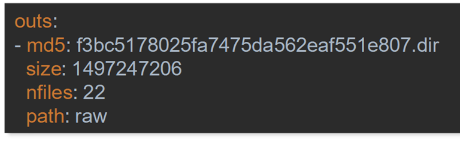

## Version your data

One key aspect of MLOps is to not only version your code, but also your data.
While small datasets can easily be stored in git, any serious data science project has too much data to work with git.
Because of this, various specialized tools exist to store versioned data.

One example that comes to mind is GitLFS, but also DVC, lakeFS and many others.
What most of those tools have in common in the usage of git to store meta-data about the stored data, but offload the actual data to an external storage system, such as an S3 object storage.

One simple example, that easily integrates into the git workflow is DVC.
DVC stands for **D**ata**V**ersion**C**ontrol and, among other things, handles the versioning of your data.
DVC (The company) has as its goal to create simple tools that do their job well.
In the case of DVC which is a python tool, it follows the usage git, with very similar commands.

After installing dvc:
```
pip install dvc
```

You can initialize a dvc project. Note that you have to inside an existing git project to do so:
```
dvc init
```

Afterwards you can add files or folders (which are not already tracked by git) to dvc with:

```
dvc add MY_FILE_OR_FOLDER
```

DVC will then create a small text file (in that case MY_FILE_OR_FOLDER.dvc) with the information about your data.



From that point forwards, git only contains the .dvc file, not the actual data.
To correctly store this, you need to add a storage location for DVC to store the data.
Here is an example for this with an S3 storage:
```
dvc remote add -d myremote s3://mybucket/path
```

Once you setup your project that way, you work similarly to git:
```
dvc commit
dvc push
dvc pull
dvc update
```