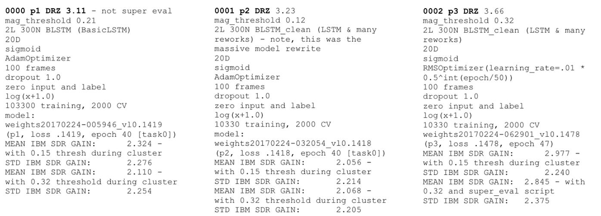

# Experiment tracking and logging
One central aspect of the MLOps approach is the ability to track experiments and compare them over time.
The classical approach is the usage of manually created text files with the most important information about an experiment.

This approach becomes quickly chaotic, as various hyperparameters and different pre-processing methods need to be tracked as well as results.
This is where automated tools take over and handle this on your behalf, with very little effort.
