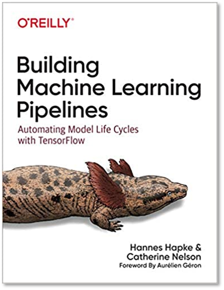
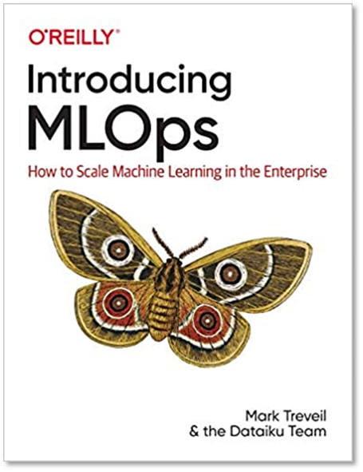

## Objectifs

- Understand what MLOps is and how it relates to DevOps
- Know the key aspects of MLOps and the data/model lifecycle
- Familiarize with a few example technologies to build a MLOps pipeline

## Prerequisits

- Git knowledge
- Usage of command line
- You must understand DevOps
- Capability to create a CI/CD pipeline on GitLab with different stages
- Basic machine learning knowledge
- Basic data-science knowledge

## Additional resources

Books
- Introducing MLOps
- Building Machine Learning Pipelines

|||
|---|---|

Videos 
- [DVC/CML](https://www.youtube.com/@dvcorg8370/videos)
- [Google](https://www.youtube.com/@googlecloudtech/videos)
- [Databricks](https://www.youtube.com/@Databricks/videos)

**Excellent practical guid to MLOps**: https://mlops.swiss-ai-center.ch/
