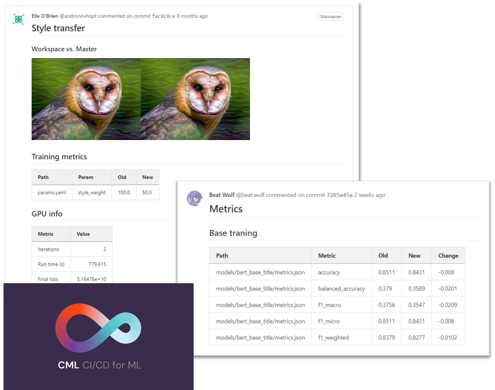

## Local or remote

Many things in MLOps can be done with a simple infrastructure.
DVC pipelines can be executed locally or a standard CI/CD pipeline and the data can be stored in S3 (Minio).
The tools for experiment tracking often come with a public cloud infrastructure free of charge (for basic usage).
Thus, setting up an initial MLOps approach does not require many resources compared to a standard DevOps approach.

For smaller projects, often the default runners of a standard CI/CD pipeline are good enough to train the models.
But once models more complicated than simple sklearn models are used, GPUs are required which are often not available.

Luckily, it easy to add your own gitlab runners to a project or a group if you have specific needs.
See the [Gitlab tutorial](https://docs.gitlab.com/ee/tutorials/create_register_first_runner/) on that subject.

## Gitlab integration
This integration into the CI/CD pipeline can go further than just executing the pipelines.
Tools like [CML](https://cml.dev/) allow you to easily compare different branches of your code.
This makes it possible to have automatic reports created for your merge requests,
which compare the performance of a model in the main and dev branch.

