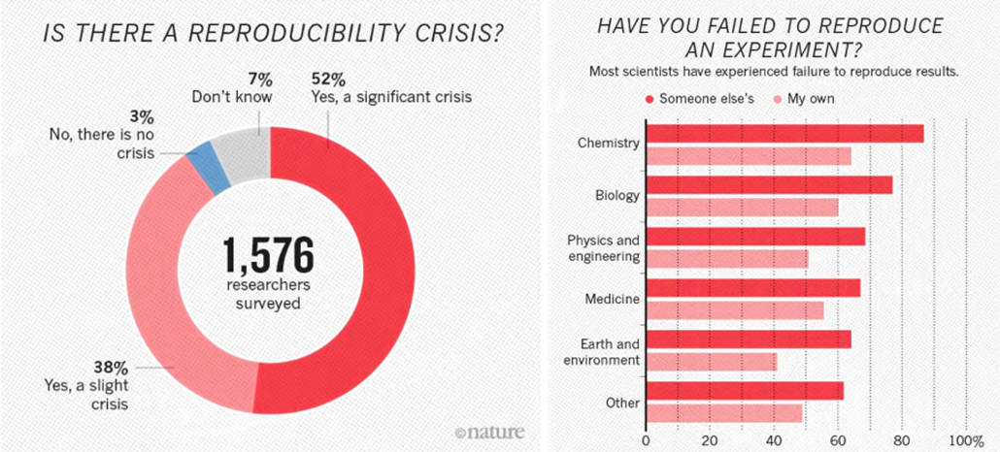
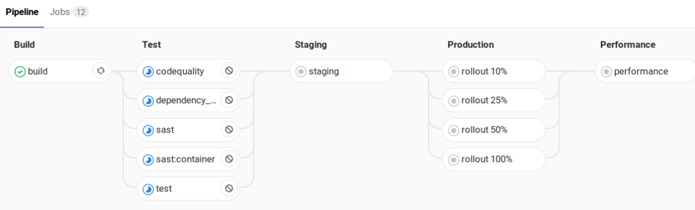
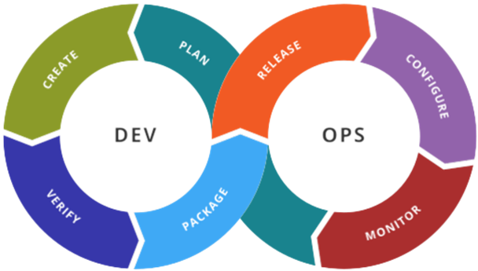
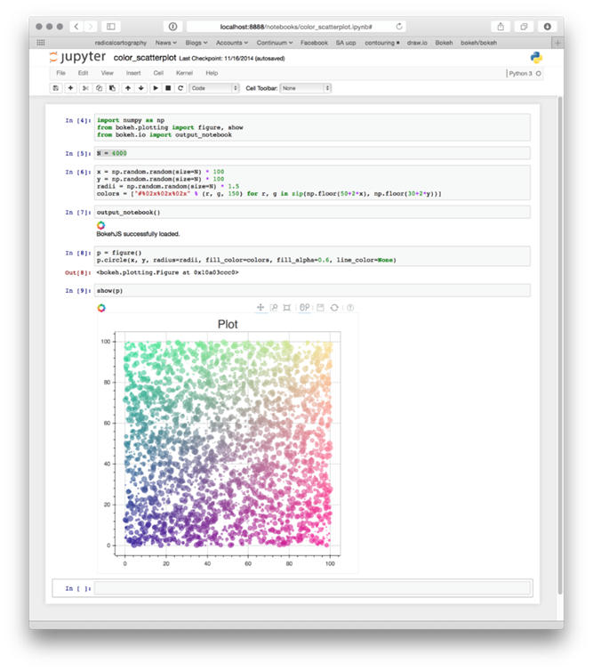
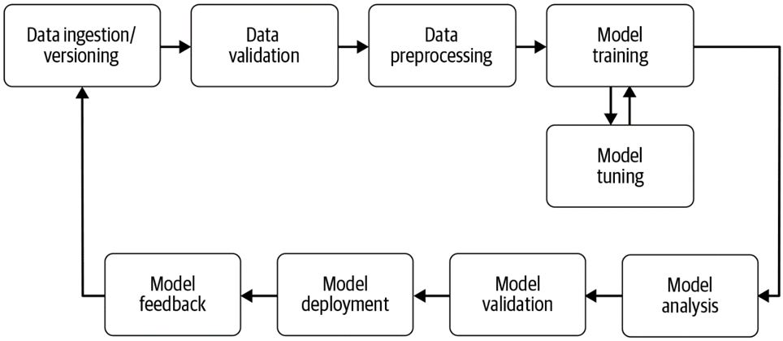
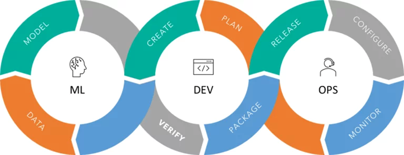

## Goals
- Show the necessity of MLOps in modern data science
- Show how MLOps and DevOps are related
- Introduce the different aspects of MLOps
- Introduce specific tools covering MLOps aspects

## Reproducability
One of the key issues DevOps and MLOps target is the reproducibility of results.
The famous "it works on my machine" is part of it, but the problem to solve is larger.
One example are scientific experiments, which most people think are always reproducible.
But in reality 70% of researchers say that they have trouble reproducing results from experiments.
Yet, in science and industry, reproducibility is key.

There are different meanings to reproducibility, which is why the Association for Computing Machinery has adopted the following definitions (Association for Computing Machinery, 2016):

- **Repeatability** Same team and experimental setup reproduce the same results
- **Replicability** Different team with same experimental setup can reproduce results
- **Reproducibility** Different team with different experimental setup reproduce the results

There are different types of reproducibility:
- **Method** Being able to reproduce an experiment with the same results
- **Results** Being able to apply a method on a different problem (which is similar) and get similar results

DevOps and MLOps are techniques to reduce this issue through a series of methologies and tools.
Some of the main methods to achieve this are to define:
- What exact version of code has been used
- How was it run exactly (Compilation, dependencies, environment etc.)
- All parameters
- The exact data used

## Classical programming and DevOps

While not perfect, the classical programming paradigm largely solved those issues when producing classical algorithms and programs.
- We know how to develop **standard algorithms** ourselves or using libraries
- The code is well **tested** with Tests on different levels (Unit, system, integration)
- The code is **versioned**
- The move from code to operations is fully automated through **CI/CD** systems

Those principles can be found in the DevOps paradigm which unifies **De**velopment and **Op**erations.
The DevOps approach is largely based on automation of jobs.
- Tests
- Builds (Docker, Jars etc)
- Deployment (Kubernetes etc.)
- Monitoring

## Machine learning
In the world of machine learning, which is at the core of MLOps, the current workflow is sadly not as well regulated.
A common tool are the Jupyter Notebooks, which often have no versioning or if they have, have a very sparse versioning (meaning, we usually can't find the jupyternotebook associated with a specific experiment).
Another aspect is the usage of data, usually in large quantities, which again is not versioned.
The dataset might change during development, either because errors have been found and corrected, or simply because it grew larger.
This issues continue, which manually trained models on developer machines, which combined with the lack of versioning for the code and data result in models that have an unclear origin.

For some reasons, the well understood DevOps principles are rarely applied when doing machine learning.

## ML Pipelines
To better understand where MLOps fits into the DevOps principles, we first look at a standard machine learning pipeline.

When looking at that pipeline, we see that it has different phases. Splitting the pipeline into different phases makes it easier to version, automate and evaluate them.
When looking at the large parts of the pipeline we can find:

- Data ingestion/versioning
  - Storage, versioning
- Data validation
  - Is the data correct? Does it satisfy my needs?
- Data pre-processing
  - Convert, clean, complete
- Model training /Model Tuning
  - Tuning, optimisation, etc.
- Model analysis
  - Performance, validity, bias, etc.
- Model deployment
  - Microservices, client, etc.
- Model feedback
  - Drift, performance, etc.

## What is MLOps really?

After looking at the classical approach of DevOps and the current state of machine learning developement, we can see that the DevOps appraoch can bring a lot to the machine learning appraoch.
Indeed, MLOps is nothing else than the extension of DevOps to the data and model aspect of machine learning.

This extension means that MLOps is largely based on DevOps tools and principles, with some added tools when necessary.
Those tools include
- **Logging** of experiments 
- **Versioning** of data
- **Automation** and reproducability of training