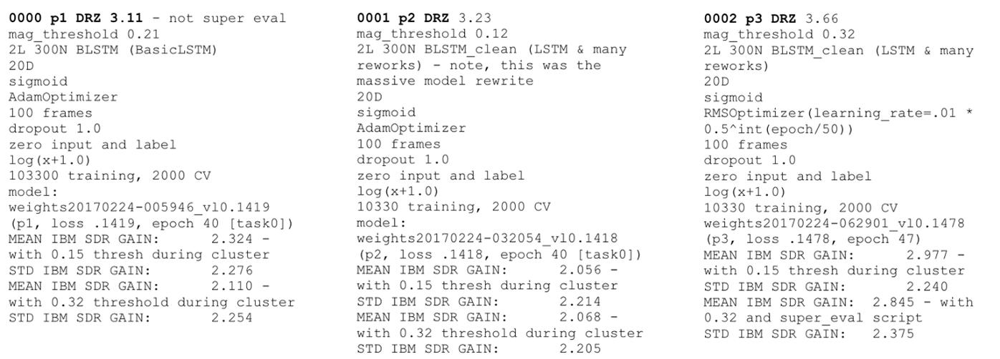
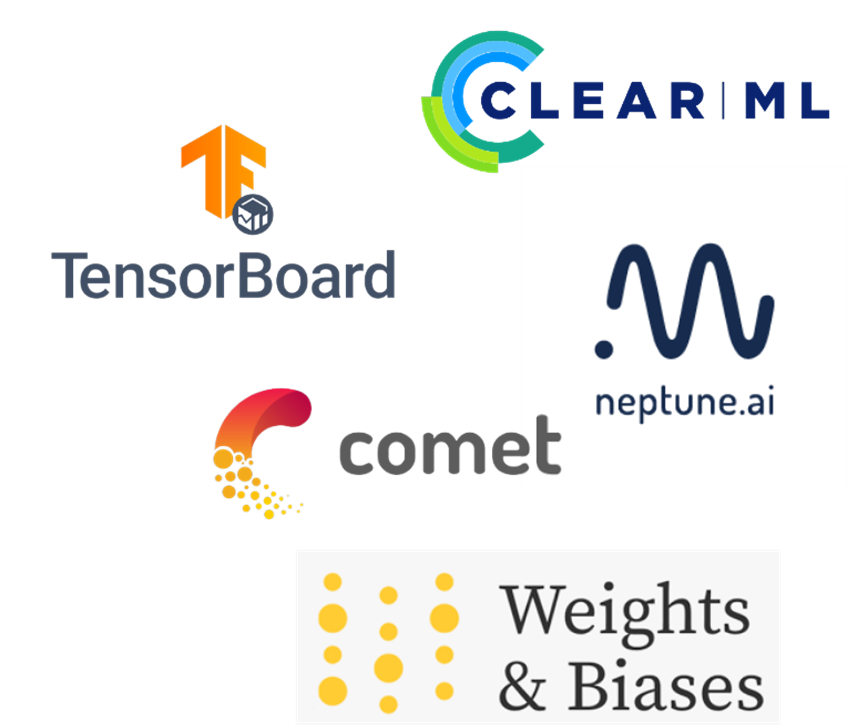
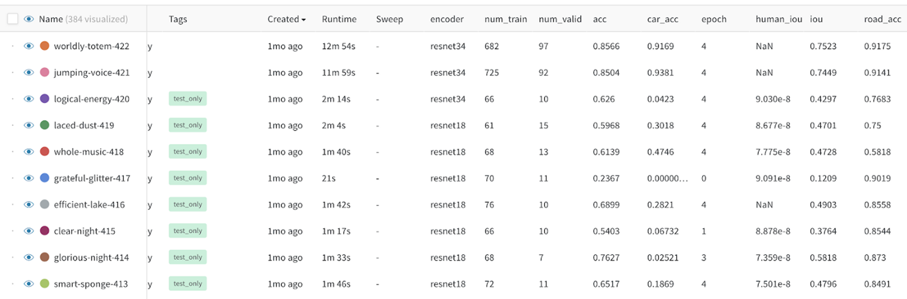
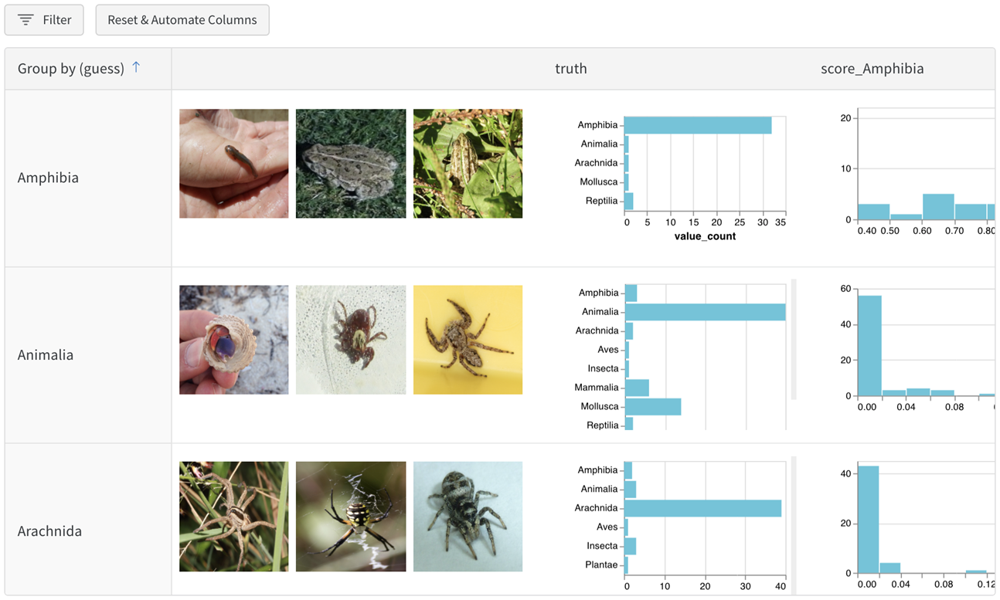
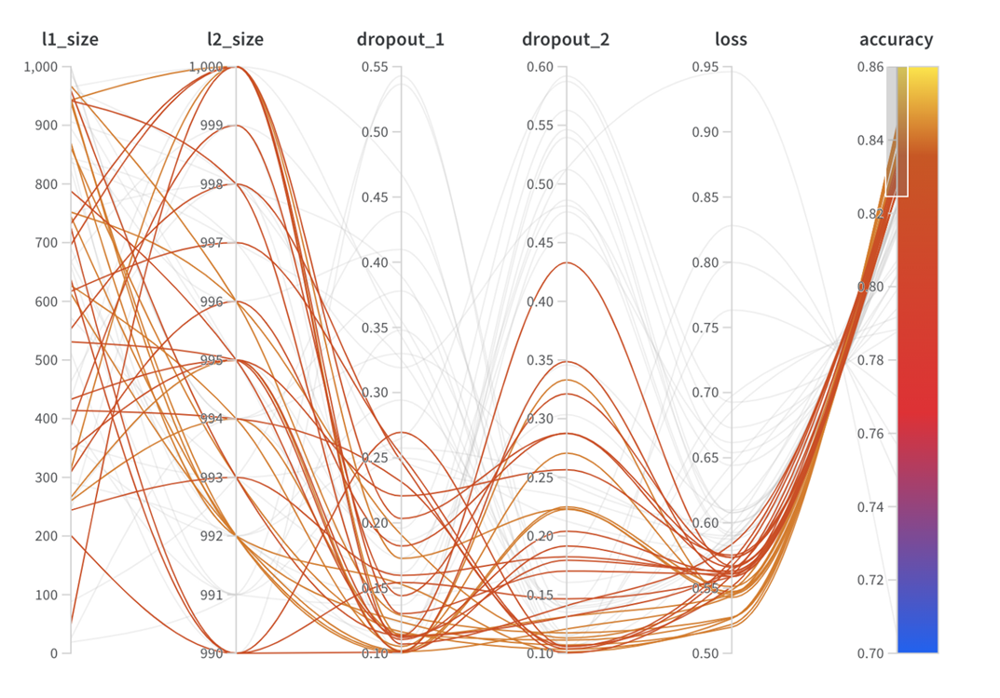

## Experiment logging

When doing machine learning experiments, one major question we have is how the different experiments we have compare to each other.
A typical fist approach is the creation of text files in which we document our experiments.
 - Parameters used
 - Data used
 - Results of the experiment



This time-consuming manual process is prone to errors and not scalable in the long run.
One easy first step to introduce MLOps principles in your workflow, is the integration of a logging framework into your jupyter notebook.

## Tools


Many different tools exist to help logging experiments.
They all offer similar features at their core:
 - Metrics logging
 - Plot storing, display and creation
 - Real time experiment tracking
 - Sharing of experiments

In addition, some of the tools integrate features that go beyond simple experiment tracking like storing and versioning code, data and trained models.

Here is a non exhaustive list of tools that can be used:
- https://wandb.ai
- https://neptune.ai
- https://clear.ml 
- https://www.comet.ml 
- https://www.tensorflow.org/tensorboard 

## Weights and Biases
Especially Weights and Biases (wandb) is used often and is a good choice for a standard logging framework.
It is able to create online overview pages of your experiments:


As well as more complex visualizations to compare different models:



Integrating the library into your existing code (Jupyter notebook or otherwise) is simple.

Here is an example code that shows the integration.

First you need to install the wandb package and login into your account:

```
pip install wandb

wandb login
```
Then you can import the wandb package and initialize your project:
``` python
import wandb
wandb.init(project="sunspots", entity="beatwolf", name="GradientBoostingRegressor")
```

Then you can log any relevant information about your experiment, here an example with the learning rate.
``` python
wandb.config.learning_rate = 0.01 #Can also be used as a dict!
```
After training your model (and even during training) you can log any relevant information.
This could be the accuracy of the model, a matplotlib plot or even raw values you want to be transformed into a plot.

``` python
wandb.log({f"accuracy" : accuracy, f"some_other_metric" : metric})

plt.plot(my_values) #We can even log plots!
wandb.log({"pred_plot": plt})

wandb.log({"my_custom_plot_id" : wandb.plot.line(my_values, "x", "y",
           title="Custom Y vs X Line Plot")})
```

At the end of your experiment you need to finish the analysis to mark the experiment as done.

``` python
wandb.finish()
```

What is also to note is that all those libraries have dedicated support for most machine learning frameworks.
- [SKLearn](https://docs.wandb.ai/guides/integrations/scikit)
- [PyTorch](https://docs.wandb.ai/guides/integrations/pytorch)
- [Tensorflow](https://docs.wandb.ai/guides/integrations/tensorflow)

You can find an excellent introduction for all this under: https://docs.wandb.ai/quickstart