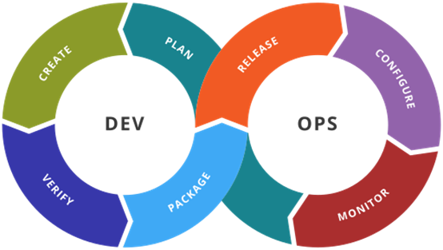
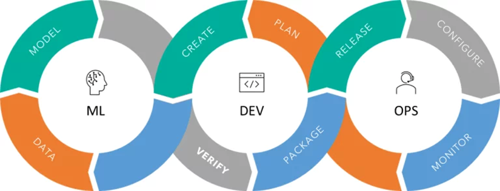
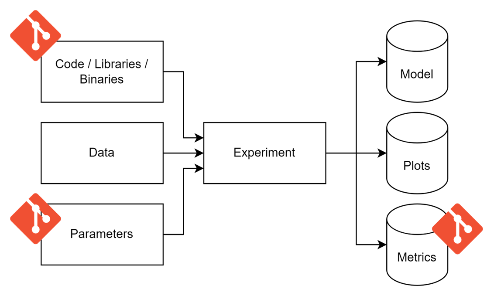
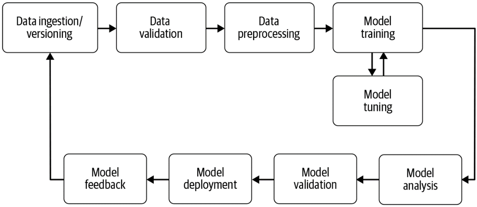
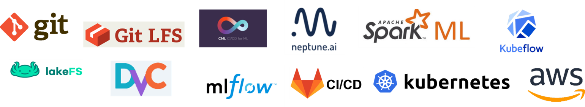

## What is MLOps?

MLOps integrates the machine learning developpment into the DevOps process.
It is an extension of the well known DevOps methodolgy, but applies it to the specific needs of machine learning.
Because of this, MLOps integrates into the DevOps technology stack and extends it where needed.

The main thing added to the DevOps practice:
- Version data as well as code
- Log experiments that produce ML models
- Create reproducable, versioned, data analysis pipelines

Those additions are not revolutions, but simply apply the DevOps principle in the domain of machine learning.
One of the key ideas is to treat data the same way as code and models like new software releases.

## Experiments
At the core of machine learning projects are the experiments. The following image shows the comparison to a classical programming project.

We can see some overlap with classical programming projects, which is natural, because machine learning projects also always involve programming.
We can see that for certain elements, such as the code, the paramaters and metrics (accuracy etc.) of the experiments, we can use the classic git approach.
But for data, the created models, the execution of the experiment itself and plots there is no clear solution in classical DevOps, which is why MLOps strategies have been developed.

## Data analysis pipelines

When doing machine learning projects, there is always some kind of pipeline involved.
Often manually executed, requiring the developer to run several CLI commands with specific parameters, they define how we go from raw data to the final deployed model.

A reasonably standard way to represent such a pipeline comes from the bool [Building Machine Learning Pipelines](https://learning.oreilly.com/library/view/building-machine-learning/9781492053187/).

We can find:
- Data ingestion/versioning
    - Storage, versioning
- Data validation
    - Is the data correct? Does it satisfy my needs?
- Data pre-processing
    - Convert, clean, complete
- Model training /Model Tuning
    - Tuning, optimisation, etc.
- Model analysis
    - Performance, validity, bias, etc.
- Model deployment
    - Microservices, client, etc.
- Model feedback
    - Drift, performance, etc.

## Technologies

