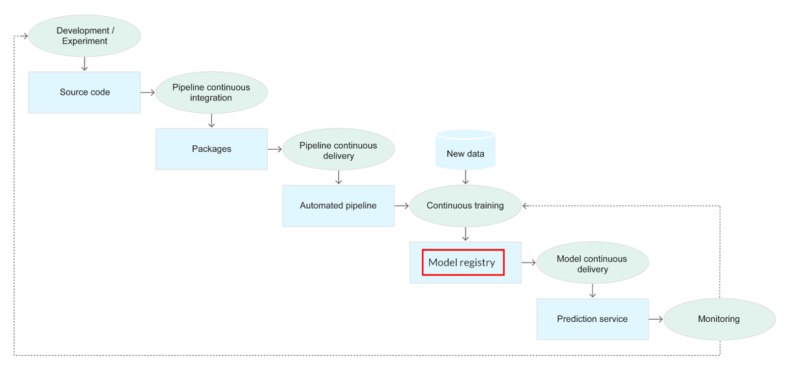

Finally, models need to be packaged, stored and versioned to be useful.
For this, model registries are used.
As their name suggests, they are similar to package or container registries.

Various tools exist to create them, to only name a few:
- MLFlow
- Neptune
- Weights and Biases
- Gitlab

The models registry is often the intersection between the ML world and the operations.

The model registry stores the information on:
- How the model was trained (versions of code, data, settings)
- How to run the model

It is both useful during developement (to compare to earlier versions of a model) and deployment.

A good insight into model registries can be found at https://neptune.ai/blog/ml-model-registry
