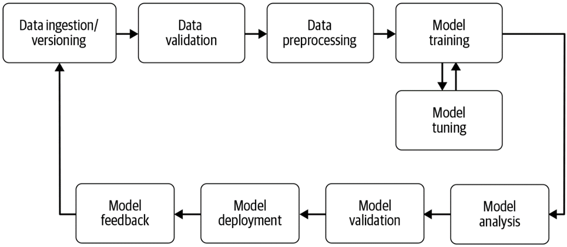

## Data analysis pipelines

As discussed earlier, typical ML project can be structured as a series of steps.
We thus come back to the example from [Building Machine Learning Pipelines](https://learning.oreilly.com/library/view/building-machine-learning/9781492053187/):


Coming from a DevOps background, this view suits us and we can quickly see the relation.

Indeed, automating this process is the last piece in the puzzle for MLOps.
To achieve this, we need to go from simple jupyter notebooks into tools/scripts that perform the individual steps.
Once this is node, we can automate the process (instead of relying on a complicated Readme).

An example would be:
- Data validation reads a data file and outputs a Markdown report
- The data pre-processing step reads a json file and outputs a csv file ready for the model training
- etc.

## Directed Acyclic Graphs
A popular way to represent those pipelines is in the form of a Directed Acyclic Graph (DAG).


Each step of the pipeline is represented as a node, with its inputs and outputs.
The inputs and outputs can be shared and reused between different processing steps, as long as no loop is created.
Once defined, the DAG can specify the whole process on how to go from the raw data to the final model and different reports.
The file(s) defining this DAG can thus be versioned and reproduced.
To do this, various tools exist to define and execute those pipelines, either locally or in the cloud.

## DVC
One of those tools is DVC (which we saw previously for the data versioning).
It allows to create pipelines through yaml files, defining the different processing steps and their respective inputs and outputs.
The definition of the pipeline is stored in a file called dvc.yaml inside an existing DVC project.

``` yaml
stages:
  prepare:
    cmd: python prepare.py data/raw.csv flt.csv
    deps:
      - prepare.py
      - data/raw.csv
    outs:
      - flt.csv
  train:
    cmd: python train.py flt.csv mdl.pt
    deps:
      - train.py
      - flt.csv
    outs:
      - mdl.pt
```
This yaml file corresponds to the following DAG:


Once the dvc.yaml file is created, we can execute it (and reproduce it) with:
```
dvc repro
```
As DVC automatically versions the data (input and output) of each step,
only the required pipeline steps are executed when the command runs.
Typically, if the data and pre-processing code does not change, only the train part of the pipeline will be executed.

Of course, pipelines can become much more complex.
Here is an example of a multi-model pipeline executed nightly on a big project:


One of the outputs in this example pipeline are markdown reports, comparing the different models.


