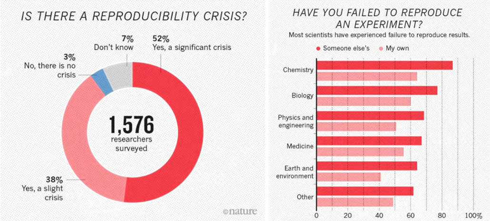
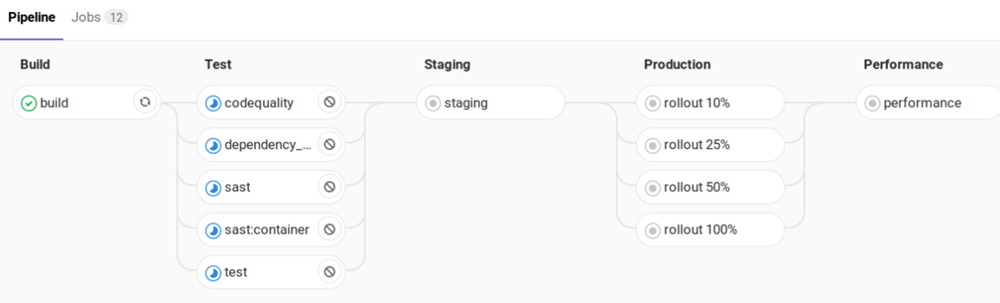
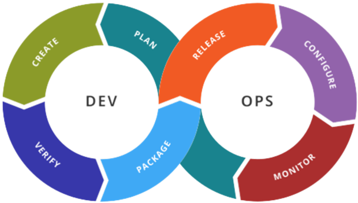
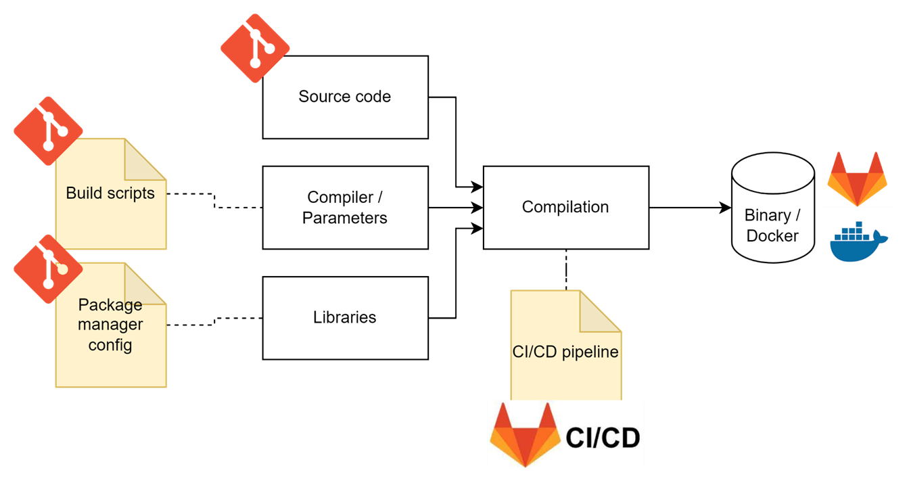

## What is it, why is it important?

Being able to reproduce experiments is crucial for scientific progress and the ability to create products.
Yet 70% of researchers have trouble reproducing experiments, with missing or even wrong information given for reproduction.
Often those mistakes are not voluntary, but simply a combination of lack of time and human error.

We distinguish two types of reproducability:

- **Method**
  - The ability to rerun an experiment and get the same results
- **Result**
  - The ability to apply a given method to a similar problem and get similar conclusions

For machine learning experiments, we need:

- The exact version of the code used
- How it was run (compilation, dependencies, etc.)
- All parameters
- The data

## Classical development
In classical software development we mostly solved the problem of reproducability.
We know how to version our code (git), we use standard algorithms and modern IDEs, we test our code automatically (unit tests, system tests etc.) and use CI/CD systems to automate the passage from new code to the deployed product.
The probably most visible example of this approach is a full CI/CD pipeline (see below) automating the process based on versioned information.

You know this approach as DevOps, which unifies development and operations.
One major contribution of DevOps is the automation of the process, thus reducing human intervention and errors.
It is important to note that DevOps is not a set of technologies, but a philosophy.

The following diagram gives a simplified overview of how a new software release is produced, and how the different parts are versioned.

We can see that on principle, software releases should be reproducable and versioned correctly when following this general approach.

## Current situation machine learning
Sadly, in the world of machine learning things often do not yet work that way.
While tools like Jupyter Notebooks are very useful and popular to quickly experiment with new ideas or visualize data,
they are often used for the full development of a machine learning model.

The rapid iterations in jupyter notebooks, while useful, offer no versioning of changes.
This makes it very difficult to understand where certain results come from or how to reproduce them.

Similarly, data is often unversioned and badly managed.
While small datasets fit in a standard git repository, the real world datasets are often too big for this approach.
This leads to different versions of the dataset (new data added, incorrect data fixed etc.) making the interpration of the results very hard.
Manual training of developer machines is also very common.
This usually involved multiple manual steps, which are not documented, requiring a specific software environment.
In the end this leads to models for which the exact data, code and parameters used are undocumented and only one person in a team being able to actually build them.

Many if not all of those problems would be solved by following the DevOps principles.

